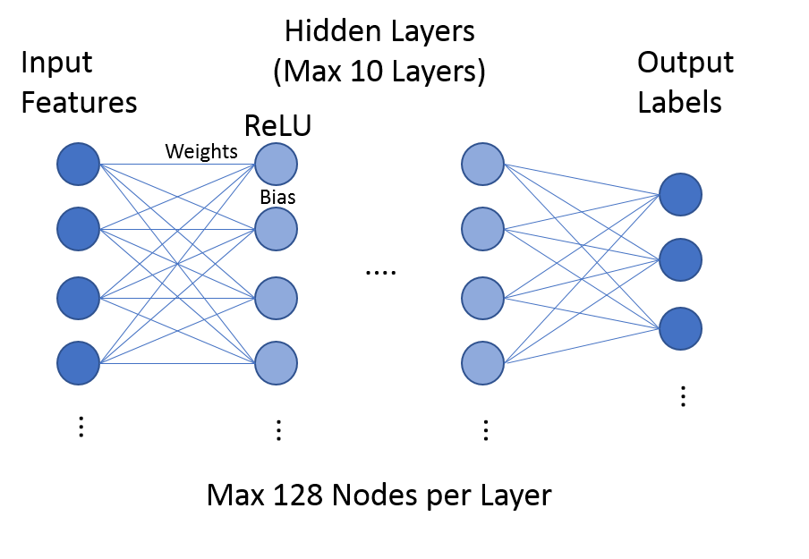

Review on Accelerating Functions in AV1
======================================

nlike HEVC HM, which is demonstrative implementation of HEVC, AV1 is more commercial available solutions, so it already includes a lot of accelerating functions such as SIMD and other fast mode algorithms and machine learning strategies to speed up the encoder. In this chapter, we will give a short discussion on these features.

\subsection{SIMD}
Most of the functions requiring more intensive computing in AV1 are offered with SIMD acceleration when the CPU is supported. Functions with SIMD support can be seen in Table.

\subsection{multi-threading}

\begin{figure}[htbp]
	\centering
		\includegraphics[width=100mm]{figures/encodingunit.png}
	\caption{super block and tile}
	\label{fig:Encodingunit}
\end{figure}

\subsection{Speed Feature}
AV1 offers 9 levels (0-8) encoding speed level, higher number means faster speed. It is achieved by skipping some encoding modes directly. For different level, certain speed features are activated. Some features are controlled depending on the resolution of the video. For example, when speed is set at level one, 720p and above videos can only use split partition for 128x128 blocks and 480p can only use split partition for when block size is larger than 64x64. In this way, it saves time by skipping encoding bigger blocks. There are also many speed features independent of videos' resolution, such as limiting transform searching depth, less accurate subpel searching or some extra analysis to prune impossible encoding modes like machine learning. All these pruning functions are also controlled by speed features. Some features may affect the video quality and some may just result in higher bit-rate. 

\subsection{Statistic Strategies}

Since there are hundreds of tool for prediction in AV1\cite{Mukherjee2017}, carefully selecting tools under different conditions can save huge amount of time. As mention earlier, using statistical results can prune impossible encoding modes. 

\paragraph{fp\_mb\_stats}
In Fig. \ref {fig:ml rd pick}, some pruning functions are just using statistic data from first pass. When enabling first pass, the square partition search will be executed and the statistic information of motion vector is used to decide if we should skip none partition directly. This is realized by using the motion vectors of neighboring blocks to evaluate the complexity of current block

\subsection{Machine Learning strategies}

In AV1, many pruning functions are driven by the machine learning. In this section, we try to discuss their functionalities in the encoder.
   

\subsubsection{Neural Network}
The NN structure used in AV1 is shown in Figure \ref{fig:NN structure}. Although it allows maximum 10 layers and 128 nodes per hidden layer. All the models used in AV1 only contain 1 or 2 hidden layers and 16 to 64 nodes per layer. All the functions' weights and bias are pre stored in the source file.

