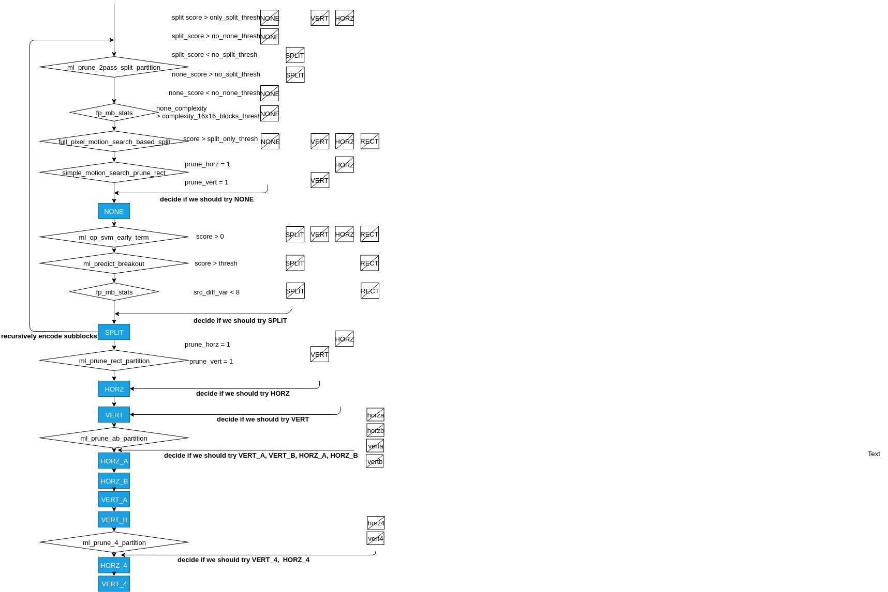

Video Codec Acceleration
======================================
For acceleration of video codec, there are two main solutions. One is hardware acceleration and normally uses ASIC or FPGA. It offers very low latency, low power consumption and can achieve real time encoding. AISC normally has higher performance, but is very expensive and thus requires economical scale to cover the developing cost. Mobile devices and PC normally can have dedicated hardware for video encoding. FPGA is more flexible but not suitable for high volume market. 

The other domain is software-based acceleration and is the focus of this work. These acceleration solution including parallelization, reduced algorithms, statistics based or machine learning based acceleration. Thanks to the improvement of general purpose CPU, multi-threading or SIMD, older encoder such as AVC can also have competitive encoding speed without dedicated hardware. Many researches also focus on the parallelization of the encoding algorithm to maximally use multi-core CPU or SIMD hardware for modern video codec. Reduced algorithms or other acceleration algorithms based on statistics or machine learning strategies are also the interest of many research groups. In the following paragraph, the related works of software-based acceleration are presented.


=======================================
Common Acceleration Strategies
=======================================

-------------
Parallelism
-------------

Parallelism can be divided into Task level and Data level parallelism. Task level parallelism means assign different functions to different computing unit. Since the different complexity of the functions, distributing the task into different multi-core processors is a challenge\cite{Yang2009}.

For data level parallelism, data can be processed on many units running the same program. It can be further divided into different levels, from Group of Pictures (GOP), frame, tile, block to instruction level. Among all the parallelisms, GOP level offers more flexibility and can preserve higher compressibility. There are already several research using GOP parallelism to improve the encoding speed \cite{Sankaraiah,Bahri2014}. Downside of GOP parallelism is that it would consume a lot of memory. The other strategy is tile level parallelism, which divides each frame into several tiles and encodes in parallel. Finally, block level parallelism is also possible but rarely used, since the communication and synchronization between blocks will consume too much time. Data in each block can also be processed in parallel by instruction level parallelism, also known as SIMD. SIMD is the most important and effective acceleration solutions and is supported by most modern processors \cite{Chi2015}. 


--------------------------
Reduced Algorithm
--------------------------

Besides maximizing parallelism among all data level (GOP, Frame, Tiles, Blocks), the other main strategy is to lower the complexity of encoder algorithm itself.
Rate-Distortion cost calculation needs to go through transform/quantization and inverse quantization/inverse transform and these recursive steps account for most of encoding time. Some researches use simplified RD cost calculation such as absolute transformed differences (SATD) to reduce the complexity\cite{Yu-MingLee2010}. Normally These strategies are not related to the contents of input video.


--------------------------
Statistic Based Approaches
--------------------------

The idea of using statistics is to discover the some signs for early termination so unnecessary computation can be avoided. Normally these algorithms collect intermediate encoding data on-line or off-line and use them to prune impossible encoding modes or steps. 

Many researchers try to use statistic analysis to eliminate the less possible splitting or prediction modes, thus can terminate the recursive process earlier \cite{Xiong2014}. This strategy is based more explicit equations designed by human beings.


----------------------------------
Machine Learning Based Approaches
----------------------------------

Using machine learning in video codecs already has a long history. Some solutions target the reductions of bit-rate, some focus on increasing the quality, and some aims at reducing encoding time.

Like statistic based solutions, machine learning can use human selected features but also raw data as input. However, unlike statistic based methods, these models are less interpretable. The model's ability to make inferences comes from the result of training with large amount of data. These machine learning algorithms include data mining, decision tree, Beysian Decision, Neural Network, Support Vector Machine(SVM)and Reinforcement Learning. These algorithms can be applied to different steps in the encoder.

\cite{Correa2014} 
\cite{Zhu2017} used SVM for both CU and PU splitting decisions with some selected features including Sum of absolute differences (SAD) between blocks, depth of current block, quantization parameters. 

In recent years, deep learning obtains more attentions due to their impressive performance in many fields.

There are many researches trying to use CNN to classify CU splitting. :cite:`Xu2018b` achieve averagely 65\% reduction of HEVC encoding time under inter mode by using CNN and Long Term Short Term Memory (LSTM). 

(Rate-Distortion Optimized Quantization: A Deep Learning Approach) used CNN for prediction of Quantization.

(Texture-Classification Accelerated CNN Scheme for Fast Intra CU Partition in HEVC) also use CNN for partition classification

A DenseNet Based Approach for Multi-Frame In-Loop Filter in HEVC used DenseNet for Loop filter 


=======================================
Current Acceleration Techniques in AV1
=======================================

AV1 uses many methods to speed up the encoder, including SIMD, multi-threading, different speed modes, and statistics and machine learning strategies. In this section, we will present a short discussion of these features.

-----------------
Speed Feature
-----------------

AV1 offers different speed modes called speed features that allows users to accelerate the encoding speed depending on the requirement of the video quality. Higher speed modes will skip some encoding tools directly.

------------------------- 
Statistic Approaches
------------------------- 

Unlike speed features, which turn off some prediction tools entirely, statistic and machine learnig approaches use intermediate encoding data to select suitable coding tools for the input block.                                         

fp_mb_stats
```````````````
When enabling first pass, the square partition search will be executed and the statistic information of motion vector is used to decide if we should skip none partition directly. This is realized by using the motion vectors of neighboring blocks to evaluate the complexity of current block

-------------------------------- 
Machine Learning Approaches
-------------------------------- 

In AV1, many pruning functions are driven by the machine learning. In this section, we try to discuss their functionalities in the encoder.
   

Neural Network
```````````````

The NN structure used in AV1 is shown in Figure \ref{fig:NN structure}. Although it allows maximum 10 layers and 128 nodes per hidden layer. All the models used in AV1 only contain 1 or 2 hidden layers and 16 to 64 nodes per layer. All the functions' weights and bias are pre stored in the source file.





