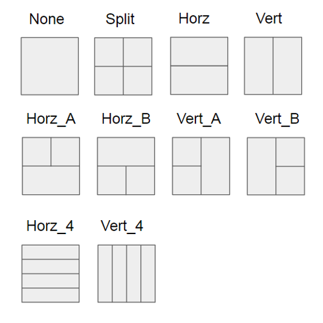

AOM AV1
============

AV1 introduces many new tools, in the following paragraph, the partition modes and the intra prediction tools are presented. Full discription of the coding tools can be found in [#]_ and [#]_.

==========================
Partition Modes
==========================

AV1 allows 10 different partiton modes as shown in the Figure below. More possible partition modes can help encoder to achieve higher compression rate.

   
   AV1 Partition Modes

==========================
Intra Prediction Tools
==========================

AV1 introduce 5 new non-directional modes and up to 56 directions for direction modes depends on the block size.

----------------
Directional Mode
----------------

AV1 offers 8 main directions ( 0, 45, 67, 90, 113, 135, 157, 203) for directional prediction and each direction can have 6 fine-tuned angles with interval of 3 degree. For example, mode with 45 degree can be fine tuned to 36, 39, 42, 48, 51, 54. In total, there are 56 directions available in compared to 33 directions in HEVC. 

For directions need top-right reference pixels, AV1 uses 1 bit of a 8-bit integer to respresent the availabity and stores it in tables for all different subblocks sizes in a 128x128 super block. For example, all the 4x4 blocks in a 128x128 SB needs 1024 bits, which requires 128 8-bit integers in a table. For bottem-left pixels, same method is applied.

.. image:: img/intramode.png

----------------
PAETH Mode
----------------

Paeth mode uses above, left and upper left pixels as reference, also shown in Fig.\ref{fig:intra mode}. The actual formula is as follows:

.. math::
      base= L+T-TL, P=argmin|x-base|, x \{T,L,TL\}

----------------
SMOOTH Mode
----------------

Smooth mode includes three modes (horizontal, vertical, bi-directional), also shown in Fig.\ref{fig:intra mode}.
The prediction formula is as follows:

.. math:: 
  PSMOOTH\_H=w(x)L+(1-w(x))TR
  PSMOOTH\_V=w(y)T+(1-w(y))BL
  PSMOOTH=1/2(PSMOOTH\_H+PSMOOTH\_V)

--------------------------------
Chroma from Luma(Cfl)
--------------------------------

Chroma from Luma uses luma prediction block for chroma prediction. The predicted luma block is first subsampled to the size of chroma then is subtracted by their average and obtain the AC contribution. the AC contribution is multiplied by the scaling factors and added to the DC prediction of chroma as shown in Fig.{fig:cfl}. Detailed explanation can be referred to \cite{Trudeau2017}. 

--------------------------------
Palette mode
--------------------------------

This tool is especially for screen content videos. It can choose up to 8 base colors for prediction. Only the colors and the index map need to be signaled into the bitstream.

--------------------------------
Recursive Intra Filter
--------------------------------

This mode divides the block into 4x2 pixels blocks and apply eight 7-tap filters for each pixels in the block.

--------------------------------
Intra Block Copy (IntraBC)
--------------------------------

This is another mode suitable for screen contents. It works similar to inter prediction but reference to the block in the same frame. 

==========================
AV1 Performance Review
==========================

Many research groups and companies have already tested and evaluated the performance of AV1. Speed of AV1 is very slow at this moment. BBC compared the efficiency between HEVC, AV1, JEM by Mean Opinion Score (MOS) and found AV1 is slightly better than HM. Fraunhofer Institute for Telecommunications also compare AV1, JEM, VP9, and HEVC encoders, the results show.
	 	 	
Grois, D et al.\cite{Grois2018} have compared the performance between AV1 and HEVC. Their result shows HM has better performance than AV1. On the other hand, the research of MSU Graphics \& Media Lab in 2018 has also showed that AV1 has superior performance than other codecs \cite{Dolganov2018}.
Some research also shows the performances between AV1 and HEVC have very similar\cite{Akyazi2018}.

Google also has showed the compression improvement when enabling the experimental tools. 
Nevertheless, it also shows the encoding speed is extremely slow. Sethuraman et al. \cite {Sethuraman2018} also shows AV1 has better performance than other video codecs but has very slow encoding time. Similar results are also performed by Facebook and Bitmovin.

In this section, we compare the encoding performance between AV1 and HEVC. We test the performance under 2 modes (CQ and VBR). For CQ mode, we compare it with HM. For VBR mode, we compare it with x265. The reason is explained in the following section.

.. [#] Urvang Joshi, Debargha Mukherjee, Jingning Han, Yue Chen, Sarah Parker, Hui Su, Angie Chiang, Yaowu Xu, Zoe Liu, Yunqing Wang, Jim Bankoski, Chen Wang, Emil Keyder, "Novel inter and intra prediction tools under consideration for the emerging AV1 video codec," Proc. SPIE 10396, Applications of Digital Image Processing XL, 103960F (19 September 2017);

.. [#] Y. Chen et al., "An Overview of Core Coding Tools in the AV1 Video Codec," 2018 Picture Coding Symposium (PCS), San Francisco, CA, 2018, pp. 41-45.
