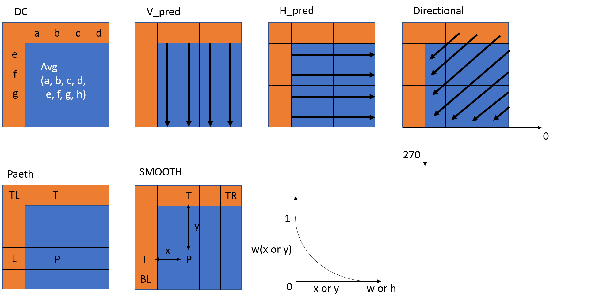

Introduction of AV1 and Intra Prediction Tools in AV1
======================================

{Directional Mode}
AV1 offers 8 main directions ( 0, 45, 67, 90, 113, 135, 157, 203) for directional prediction and each direction can have 6 fine-tuned angles with interval of 3 degree. For example, mode with 45 degree can be fine tuned to 36, 39, 42, 48, 51, 54. In total, there are 56 directions available in compared to 33 directions in HEVC. 

For directions need top-right reference pixels, AV1 uses 1 bit of a 8-bit integer to respresent the availabity and stores it in tables for all different subblocks sizes in a 128x128 super block. For example, all the 4x4 blocks in a 128x128 SB needs 1024 bits, which requires 128 8-bit integers in a table. For bottem-left pixels, same method is applied.

{PAETH Mode}

Paeth mode uses above, left and upper left pixels as reference, also shown in Fig.\ref{fig:intra mode}. The actual formula is as follows:
$base= L+T-TL, P=argmin|x-base|, x \{T,L,TL\}$

{SMOOTH Mode}
Smooth mode includes three modes (horizontal, vertical, bi-directional), also shown in Fig.\ref{fig:intra mode}.
The prediction formula is as follows:
PSMOOTH\_H=w(x)L+(1-w(x))TR
PSMOOTH\_V=w(y)T+(1-w(y))BL
PSMOOTH=1/2(PSMOOTH\_H+PSMOOTH\_V)

{Chroma from Luma(Cfl)}
Chroma from Luma uses luma prediction block for chroma prediction. The predicted luma block is first subsampled to the size of chroma then is subtracted by their average and obtain the AC contribution. the AC contribution is multiplied by the scaling factors and added to the DC prediction of chroma as shown in Fig.{fig:cfl}. Detailed explanation can be referred to \cite{Trudeau2017}. 

{Palette mode}
This tool is especially for screen content videos. It can choose up to 8 base colors for prediction. Only the colors and the index map need to be signaled into the bitstream.

{Recursive Intra Filter}
This mode divides the block into 4x2 pixels blocks and apply eight 7-tap filters for each pixels in the block.

{Intra Block Copy (IntraBC)}
This is another mode suitable for screen contents. It works similar to inter prediction but reference to the block in the same frame. 
