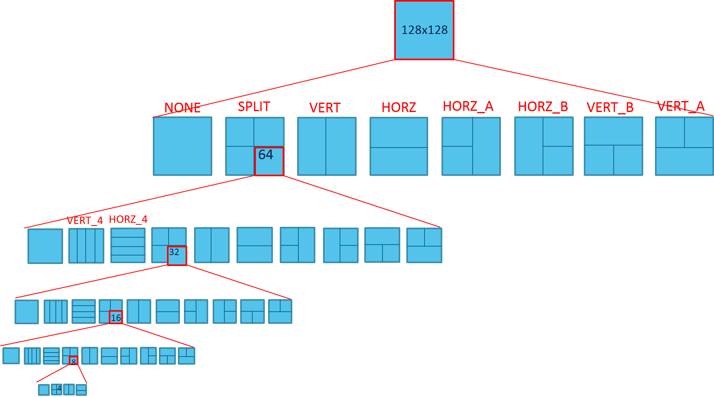
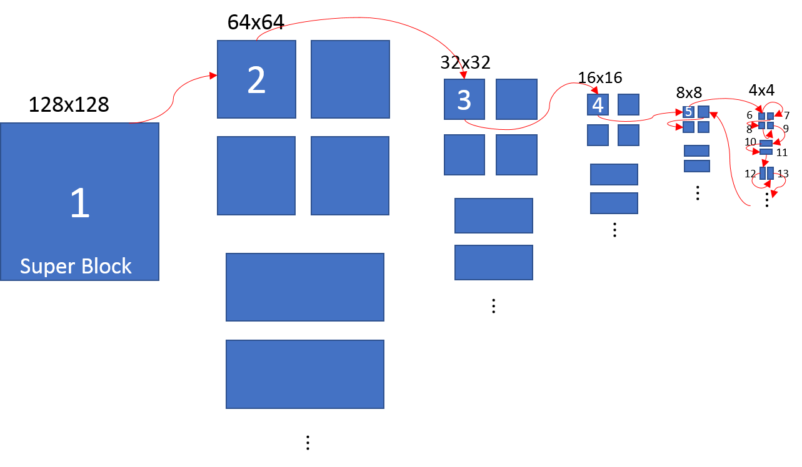
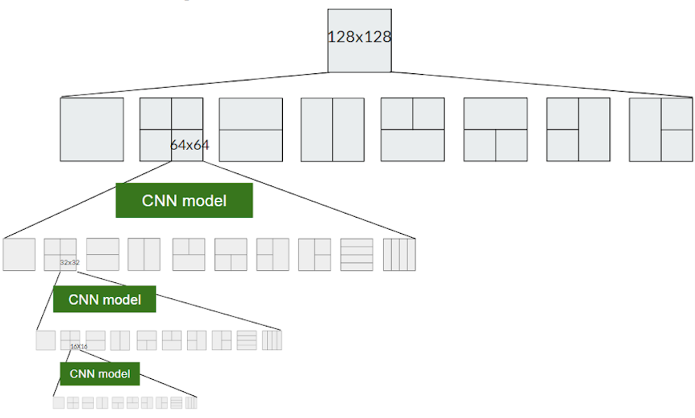

CNN AV1 Intra Encoder
======================

As mentioned in chapter \ref{Related Work}, there are many ways of using CNN to replace some encoding steps in the encoder as shown in Fig \ref{fig:CNN for encoder}. However, applying CNN for partition may save the most encoding time compared to other steps, since prediction and transform functions are sub-functions of partition functions. Replacing partition function means skipping the whole RDO process, which includes prediction, transform, quantization, dequantization and inverse transform and entropy coding. classification on CU splitting decision making can maximally save the encoding time compared to classification for PU and TU. 

And according to the results of previous researches, using CNN model to predict the partition decisions for intra frames shows better performance than other solutions. It may because that, unlike inter frames, intra frame doesn't need information from other frames. Although encoding intra frames requires pixel values from adjacent blocks, the contents of each image block also contain crucial information for selecting the partition mode. 
And since CNN is very powerful in image recognition, it is very suitable to decide block splitting. For example, flat area can be coded in bigger block, so the better partition decision is not to split. CNN may connect these features with the final partition decisions through training large amount of data.

==========================================
Partition Decision for Intra Frame in AV1
==========================================

--------------------
RDO process in AV1
--------------------

To decide the partition mode for each block, the encoder will go through the Rate-Distortion Optimization (RDO) Process to find the partition mode with lowest rate-distortion (RD) cost. 
For intra frame, the encoder will only use intra prediction tools to calculate the residues of block. 

==========================================================
Partition Mode Prediction with CNN for Intra Frame
==========================================================

The whole partition decision is very time consuming. Thus, use CNN 

================================== 
CNN Model in This Research
================================== 

Several CNN models are designed to evaluate the prediction performance.

.. code-block:: python

    image = Input(shape=(block_size,block_size,NUM_CHANNELS))

    image_norm = Lambda(sub_mean)(image)

    conv1 = Conv2D(16, (3, 3), strides =(1,1),padding='valid', activation='relu')(image_norm)
    
    conv2 = Conv2D(32, (3, 3), strides =(1,1), padding='valid', activation='relu')(conv1)
   
    conv2_pooling = MaxPooling2D(pool_size=(2, 2))(conv2)
    conv2_drop = Dropout(rate = 0.5)(conv2_pooling)

    flat2 = Flatten()(conv2_drop)

    qp = Input(shape=(1,))

    qp_n = Lambda(lambda x: x/255)(qp)

    flat2_qp = Concatenate(axis=1)([flat2, qp_n])

    fc1 = Dense(128, activation='relu')(flat2_qp)
    fc1_d = Dropout(rate = 0.5)(fc1)

    fc1_qp = Concatenate(axis=1)([fc1_d, qp_n])

    output = Dense(num_classes, activation='softmax')(fc1_qp)

    model = Model(inputs=[image,qp], outputs=output)

    model.summary()

    model.compile(loss='categorical_crossentropy',
                  optimizer=keras.optimizers.Adam(lr=0.001),
                  metrics=['accuracy'])

.. code-block:: python

 data = Input(shape=(block_size,block_size,NUM_CHANNELS))

    data_norm = Lambda(sub_mean)(data)

    conv1 = Conv2D(32, (3, 3), strides =(1,1),padding='valid', activation='relu')(data_norm)
    conv1_dropout = Dropout(rate=0.5)(conv1)
 

    conv2 = Conv2D(64, (3, 3), strides =(1,1), activation='relu', padding='valid')(conv1)
    conv2_dropout = Dropout(rate=0.5)(conv2)
    
    conv3 = Conv2D(128, (3, 3), strides =(1,1), activation='relu', padding='valid')(conv2)
    conv3_dropout = Dropout(rate=0.5)(conv3)

    conv3_pooling = MaxPooling2D(pool_size=(2, 2))(conv3_dropout)
    conv3_d = Dropout(0.25)(conv3_pooling)
    flat3 = Flatten()(conv3_d)

    qp = Input(shape=(1,))
    qp_n = Lambda(lambda x: x/255)(qp)

    concat = Concatenate(axis=1)([flat3, qp_n])

    fc1 = Dense(128, activation='relu')(concat)
    fc1_d = Dropout(rate=0.5)(fc1)
    fc1_qp = Concatenate(axis=1)([fc1_d, qp_n])

    #fc2 = Dense(48, activation='relu')(fc1_qp)
    #fc2_qp = Concatenate(axis=1)([fc2, qp_n])

    output = Dense(num_classes, activation='softmax')(fc1_qp)

    model = Model(inputs=[data,qp], outputs=output)

    model.summary()

    model.compile(loss='categorical_crossentropy',
                  optimizer=keras.optimizers.Adam(lr=0.001),
                  metrics=['accuracy'])

A model that is similar to other paper 

A model inspired by Google inception is also tested

Table xx shows the number of parameter

============================
Encoder Modification
============================

Following files in the source files are modified for inetgrating CNN model into AV1. The version of AV1 encoder is "1.0.0-2231-g9666276"

The following files are changed to pass the file name to CNN model

-----------------------
aom/src/aom_codec.h
-----------------------

Add the pointer of **filename** to aom_codec_ctx. Ths structure is the member called encoder of the structure stream state.

.. code-block:: c

 typedef struct aom_codec_ctx {
  const char *filename;
  ...
 } aom_codec_ctx_t;
 

-----------------------
apps/aomenc.c
-----------------------

Pass filename to the member enocder of the stream. 

.. code-block:: c

   FOREACH_STREAM(stream, streams) { 
      stream->encoder.filename=input.filename;
      initialize_encoder(stream, &global); }

-----------------------------------
aom/internal/aom_codec_internal.h
-----------------------------------

Add new member **filename** to the structure **aom_codec_priv**. It is a member of **aom_codec_ctx**.

.. code-block:: c

  struct aom_codec_priv {
    const char *filename;
    ...
  };
  

-----------------------------------
av1/encoder/encoder.h
------------------------------------
Add member **filename** to the structure **AV1_COMP**. Also, add an array member that stores the partition index from CNN model.
  
.. code-block:: c

  typedef struct AV1_COMP {
    const char *filename;
    ...
    int prediction[3][135][240];
    ...
  } AV1_COMP;

---------------------------
av1/encoder/encoder.c
---------------------------

In the function **av1_create_compressor**, add the code to set up memory space for the prediction array.

.. code-block:: c

    memset(cpi->prediction, 0, sizeof(cpi->prediction));

--------------------
av1/av1_cx_iface.c
--------------------

In the function **encoder_init**, pass the filename from **aom_codec_ctx** to **AV1_COMP** by adding the following code.

.. code-block:: c

  if (res == AOM_CODEC_OK) {
        ...
        priv->cpi->filename = ctx->filename;     
      }

----------------------------
av1/encoder/encode_frame.c
----------------------------

In the function **encode_frame_internal**, add the following code to call CNN model in python script. This code first calls CNN model for partition prediction in python, and then read the prediction result from cu_depth.txt into the array set up beforehand.  

.. code-block:: c

  struct aom_usec_timer time_python;
      aom_usec_timer_start(&time_python);
      
      char cmd[100];
      sprintf(cmd, "python3 video_to_cu_depth_all.py %s %d %d %d %d %d",cpi->filename,cm->width, cm->height, cm->base_qindex, 0, cm->current_frame.order_hint);
      printf("%s\n", cmd);
      system(cmd)==0;
    
      aom_usec_timer_mark(&time_python);
      uint64_t time_for_python = aom_usec_timer_elapsed(&time_python);
      printf("time_for_python=%d\n", time_for_python);
      
      struct aom_usec_timer time_r;
      aom_usec_timer_start(&time_r);
      
      FILE *in_file  = fopen("cu_depth.txt", "r"); 
    	  if (in_file == NULL) 
    			{	
    			printf("Error! Could not open file\n"); 
    			exit(-1); // must include stdlib.h 
    			} 
    	
    	int block_width = cm->width>>6;
    	int block_height = cm->height>>6;
    	int cols = block_width*64 < cm->width ? block_width+1 : block_width; 
    	int rows = block_height*64 < cm->height ? block_height+1 : block_height; 
        int blocksize =0;
       	
    	for (int row = 0; row < rows; row++){
    	  for (int col = 0; col < cols; col++){
    	
    	   fscanf(in_file,"%1d", &cpi->prediction[blocksize][row][col]);
    	  }
    		}
    	block_width = cm->width>>5;
    	block_height = cm->height>>5;
    	cols = block_width*32 < cm->width ? block_width+1 : block_width; 
    	rows = block_height*32 < cm->height ? block_height+1 : block_height; 
    	blocksize =1;
    		
    	for (int row = 0; row < rows; row++){
    	   for (int col = 0; col < cols; col++){
    		
    		 fscanf(in_file,"%1d", &cpi->prediction[blocksize][row][col]);
    		}
    		}
    	block_width = cm->width>>4;
    	block_height = cm->height>>4;
    	cols = block_width*16 < cm->width ? block_width+1 : block_width; 
    	rows = block_height*16 < cm->height ? block_height+1 : block_height; 
    	blocksize =2;
    		
    		for (int row = 0; row < rows; row++){
    		  for (int col = 0; col < cols; col++){
    		
    		   fscanf(in_file,"%1d", &cpi->prediction[blocksize][row][col]);
    		  }
    	  	}	
    	
       aom_usec_timer_mark(&time_r);
       uint64_t time_for_read = aom_usec_timer_elapsed(&time_r);
       printf("time_for_read=%d\n", time_for_read);
     

In the function **rd_pick_partition**, add the following code to replace the original algorithms. Since only 3 block sizes are considered, the condition is set as following code.

.. code-block:: c

  if (bsize == BLOCK_64X64 || bsize == BLOCK_32X32 || bsize == BLOCK_16X16)
	   {
          int row, col, blocksize;        
          switch(bsize){
	      case BLOCK_64X64: blocksize=0;
	                     row = mi_row>>4;
	                     col = mi_col>>4;
                             break;
              case BLOCK_32X32: blocksize=1;
                             row = mi_row>>3;
	                     col = mi_col>>3;
                             break;
              case BLOCK_16X16: blocksize=2;
                             row = mi_row>>2;
	                     col = mi_col>>2;
                             break;
                        }
	   switch (cpi->prediction[blocksize][row][col])
		    {
	         case PARTITION_NONE: goto DO_PARTITION_NONE;				   
	         case PARTITION_HORZ: goto DO_PARTITION_HORZ;
   	         case PARTITION_VERT:  goto DO_PARTITION_VERT;
	   	 case PARTITION_SPLIT: goto DO_PARTITION_SPLIT;
      		 case PARTITION_HORZ_A: goto DO_PARTITION_HORZ_A;
	      	 case PARTITION_HORZ_B: goto DO_PARTITION_HORZ_B;
	      	 case PARTITION_VERT_A: goto DO_PARTITION_VERT_A;
	      	 case PARTITION_VERT_B: goto DO_PARTITION_VERT_B;
      		 case PARTITION_HORZ_4: goto DO_PARTITION_HORZ_4;
   	   	 case PARTITION_VERT_4: goto DO_PARTITION_VERT_4;
	  	   }
	 	   }
    ...
    
    DO_PARTITION_NONE:
    
    if (bsize == BLOCK_64X64 || bsize == BLOCK_32X32 || bsize == BLOCK_16X16)
	   partition_none_allowed=1;
    
    // PARTITION_NONE
    ...
    if (bsize == BLOCK_64X64 || bsize == BLOCK_32X32 || bsize == BLOCK_16X16)
	   goto ENDING;
	
	
    DO_PARTITION_SPLIT:
    
    if (bsize == BLOCK_64X64 || bsize == BLOCK_32X32 || bsize == BLOCK_16X16)
	   do_square_split=1;
    
    // PARTITION_SPLIT
    ...
    if (bsize == BLOCK_64X64 || bsize == BLOCK_32X32 || bsize == BLOCK_16X16)
   	goto ENDING;
   
    DO_PARTITION_HORZ:
    
    if (bsize == BLOCK_64X64 || bsize == BLOCK_32X32 || bsize == BLOCK_16X16)
	 {
		 partition_horz_allowed=1;
	    	 prune_horz=0;
	    	 do_rectangular_split=1;
	  }
     
     //PARTITION_HORZ
     ...
     if (bsize == BLOCK_64X64 || bsize == BLOCK_32X32 || bsize == BLOCK_16X16)
		   goto ENDING;
		   
     DO_PARTITION_VERT:
     
     if (bsize == BLOCK_64X64 || bsize == BLOCK_32X32 || bsize == BLOCK_16X16)
	     {   
	       partition_vert_allowed=1;
     	       prune_vert=0;
	       do_rectangular_split=1;
	      }
       
      // PARTITION_VERT
      ...
      if (bsize == BLOCK_64X64 || bsize == BLOCK_32X32 || bsize == BLOCK_16X16)
	     goto ENDING;
      ...
      
      DO_PARTITION_HORZ_A:

     if (bsize == BLOCK_64X64 || bsize == BLOCK_32X32 || bsize == BLOCK_16X16)	  
            {	
                partition_horz_allowed=1;
	      	horza_partition_allowed=1;	
	     }
      
      //PARTITION_HORZ_A:
      ...
      if (bsize == BLOCK_64X64 || bsize == BLOCK_32X32 || bsize == BLOCK_16X16)
	     goto ENDING;
	   
      DO_PARTITION_HORZ_B:
      if (bsize == BLOCK_64X64 || bsize == BLOCK_32X32 || bsize == BLOCK_16X16)
	     {  
	           partition_horz_allowed=1;
		   horzb_partition_allowed=1;
              }
      
      // PARTITION_HORZ_B
      ...
      if (bsize == BLOCK_64X64 || bsize == BLOCK_32X32 || bsize == BLOCK_16X16)
	     goto ENDING;
		
      DO_PARTITION_VERT_A:
      
      if (bsize == BLOCK_64X64 || bsize == BLOCK_32X32 || bsize == BLOCK_16X16)
		    {  
		    verta_partition_allowed=1;
	       	    partition_vert_allowed=1;
		    }
      
      // PARTITION_VERT_A
	     ...
      
      if (bsize == BLOCK_64X64 || bsize == BLOCK_32X32 || bsize == BLOCK_16X16)
      goto ENDING;
	   
      DO_PARTITION_VERT_B:
      if (bsize == BLOCK_64X64 || bsize == BLOCK_32X32 || bsize == BLOCK_16X16)
		    {   
		        vertb_partition_allowed=1;
		        partition_vert_allowed=1;
		    }
      
      // PARTITION_VERT_B
      ...
      
      if (bsize == BLOCK_64X64 || bsize == BLOCK_32X32 || bsize == BLOCK_16X16)
	     goto ENDING;
      
      DO_PARTITION_HORZ_4:

      if (bsize == BLOCK_64X64 || bsize == BLOCK_32X32 || bsize == BLOCK_16X16)
         {   
           partition_horz4_allowed=1;
           do_rectangular_split=1;
         }
       
       // PARTITION_HORZ_4
       ...
       if (bsize == BLOCK_64X64 || bsize == BLOCK_32X32 || bsize == BLOCK_16X16)
	      goto ENDING;
		  
       DO_PARTITION_VERT_4:
       
       if (bsize == BLOCK_64X64 || bsize == BLOCK_32X32 || bsize == BLOCK_16X16)
		  {
		        partition_vert4_allowed=1;
		        do_rectangular_split=1;
		   }
		   
        // PARTITION_VERT_4
        ...
        if (bsize == BLOCK_64X64 || bsize == BLOCK_32X32 || bsize == BLOCK_16X16)
	       goto ENDING;
       
        ...

        ENDING:

