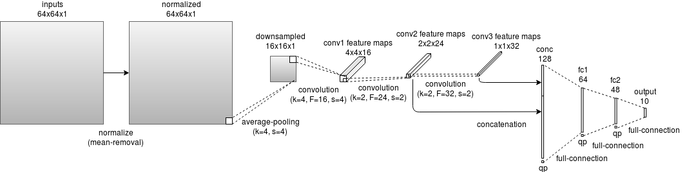
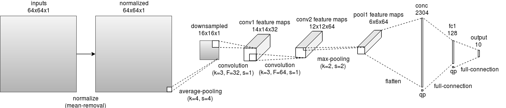

CNN AV1 Intra Encoder
======================

As mentioned in :doc: acceleration_encoding, there are many ways of using CNN to replace some encoding steps in the encoder as shown in Fig \ref{fig:CNN for encoder}. However, applying CNN for partition may save the most encoding time compared to other steps, since prediction and transform functions are sub-functions of partition functions. Replacing partition function means skipping the whole RDO process, which includes prediction, transform, quantization, dequantization and inverse transform and entropy coding. classification on CU splitting decision making can maximally save the encoding time compared to classification for PU and TU. 

And according to the results of previous researches, using CNN model to predict the partition decisions for intra frames shows better performance than other solutions. It may because that, unlike inter frames, intra frame doesn't need information from other frames. Although encoding intra frames requires pixel values from adjacent blocks, the contents of each image block also contain crucial information for selecting the partition mode. 
And since CNN is very powerful in image recognition, it is very suitable to decide block splitting. For example, flat area can be coded in bigger block, so the better partition decision is not to split. CNN may connect these features with the final partition decisions through training large amount of data.

==========================================
Partition Decision for Intra Frame in AV1
==========================================

In this section, a simple demonstration of how partition decision is made in AV1 is presented. As mentioned previously, the partition decition is made based on RDO process.

To decide the partition mode for each block, the encoder will go through the Rate-Distortion Optimization (RDO) Process to find the partition mode with lowest rate-distortion (RD) cost. 
For intra frame, the encoder will only use intra prediction tools to calculate the residues of block. 

.. image:: img/Partitionhierarchy.png

.. image:: img/OrderofRDcalculation.png

=========================================================================================
Current Statistic and Machine Learning Strategies for Partition Mode Selection in AV1
=========================================================================================

In order to save encoding time, AV1 applies the most acceleration functions in partition mode selections, as shown in figure below.

.. image:: img/ml_rd_pick.png

All the machine learning functions share the same simple neural network structure as shown in the Figure below. Although it allows maximum 10 layers and 128 nodes per hidden layer. All the models used in AV1 only contain 1 or 2 hidden layers and 16 to 64 nodes per layer. All the functions' weights and bias are pre stored in the source file.

.. image:: img/NNstructure.png
   :width: 60%
   :align: center

==========================================================
Partition Mode Prediction with CNN for Intra Frame
==========================================================

The whole partition decision is very time consuming. Thus, use CNN 

.. image:: img/CNN_for_partition.png

================================== 
CNN Model in This Research
================================== 

Several CNN models are designed to evaluate the prediction performance.

:doc:`source code <source_code>`

code

A model that is similar to other paper 

A model inspired by Google inception is also tested

The number of parameters of the two models are shown in table 1 and table 2.

.. list-table:: tianyili
   :widths: 10 10 10 10 10 
   :header-rows: 1

   * - Layer
     - Weights
     - Bias
     - Addition
     - Multiplication
   * - Conv1
     - 256
     - 16
     - 3856
     - 4096
   * - Conv2
     - 1536
     - 24
     - 4632
     - 6144
   * - Conv3
     - 3072
     - 32
     - 2336
     - 3072
   * - FC1
     - 8256
     - 64
     - 8256
     - 14400
   * - FC2
     - 3120
     - 48
     - 3072
     - 3120
   * - Output
     - 490
     - 10
     - 190
     - 490
   * - Total
     - 16730
     - 194
     - 22342
     - 31322
     

The number of parameters of the two models are shown in table 1 and table 2.

.. list-table:: mnist_modify
   :widths: 10 10 10 10 10 
   :header-rows: 1

   * - Layer
     - Weights
     - Bias
     - Addition
     - Multiplication
   * - Conv1
     - 288
     - 32
     - 
     - 
   * - Conv2
     - 18432
     - 64
     - 
     - 
   * - FC1
     - 295040
     - 128
     -  
     -  
   * - Output
     - 1290
     - 10
     - 
     - 
   * - Total
     - 313760 
     - 234
     -  
     -  

============================
Encoder Modification
============================

Following files in the source files are modified for inetgrating CNN model into AV1. The version of AV1 encoder is "1.0.0-2231-g9666276"

