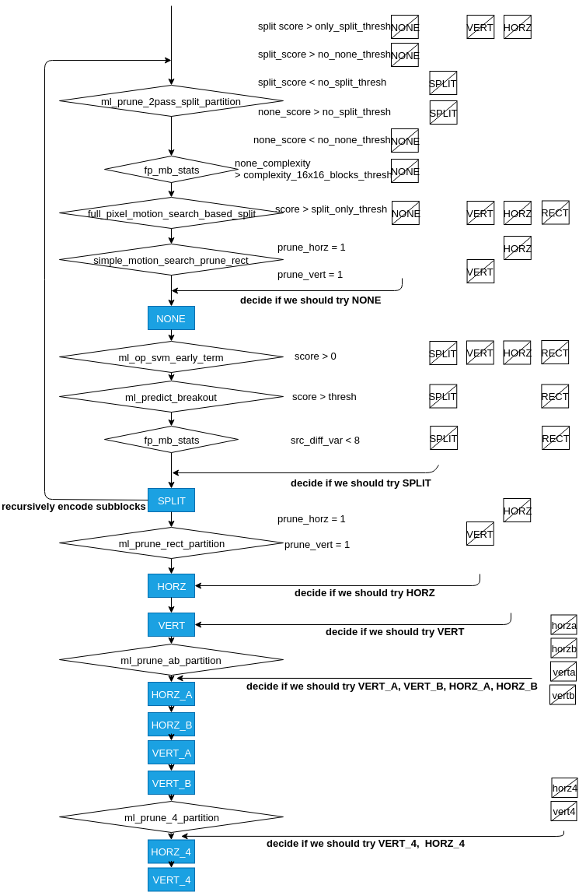

CNN AV1 Intra Encoder
======================

As mentioned in :doc: acceleration_encoding, although there are many ways of replacing encoding steps with machine learning, applying machine learning for partition prediction may save the most encoding time compared to other steps. The reason is partition decision is at the upper position of RDO process. The time saved comes from skipping most encoding steps like prediction, transform and quantization. 

For intra frame encoding, CNN has the potential to directly learn the relation between the raw pixels and its suitable partition mode. 
For example, CNN may be able to reconize that flat area can be coded without splitting.

==========================================
Partition Decision for Intra Frame in AV1
==========================================

As mentioned earlier, RDO process is to find the best coding mode for the each encoding block, which includes steps of prediction, transform, quantization, inverse quantization, inverse transform and entropy coding. And a parition decision is made from repeating this loop. 

The actual order of the RDO process for each block is recurrsive and shown below:

The encoder will go down the smallest block 

=========================================================================================
Current Fast Partition Mode Selection Strategies in AV1
=========================================================================================

To experience all the partition modes is very time consuming. Both satistical and machine learning based strategies are used for fast partition mode selection in AV1, as shown in figure below.

Two satistical methods in fast partition mode selection. One uses information collected in first pass encoding to decide if None mode should be skipped for 16x16 blocks. The other one is based on motion vector search results to decide if it should directly go to Split mode and skip others.

The machine learning model includes support vector machine (SVM) and neural network (NN). SVM takes the encoding results from None mode to decide if the encoding should be terminated. The neural network is used before every partition mode to decide if the partition mode can be skipped. The structure is shown in the Figure below. Although it allows maximum 10 layers and 128 nodes per hidden layer. All the models used in AV1 only contain 1 or 2 hidden layers and 16 to 64 nodes per layer. All the functions' weights and bias are pre-stored in the source file.

.. image:: img/NNstructure.png
   :width: 60%
   :align: center

For both SVM and NN model. the input features are very similar for each model as follows:
RD cost, 

It can be seen that some purposes of the functions are overlapped. Decision made based on multiple algorithms can ensure more accurate prediction.

==========================================================
Partition Mode Prediction with CNN for Intra Frame
==========================================================

As can be seen above, machine learning models predict sequentially to decide if certain mode should be skipped and all the models rely on handcraft features as input.

In this research, the CNN model is used to assign partition mode for the encoding block directly based on the raw image as input. Three block sizes are predicted to save encoding time maximumly. 

.. image:: img/CNN_for_partition.png

================================== 
CNN Model in This Research
================================== 

Two main CNN models are designed to evaluate the prediction performance.

:doc:`source code <source_code>`

.. image:: img/mnist_model.png

code

A model that is similar to other paper 

A model inspired by Google inception is also tested

The number of trainable parameters of the two models are shown in table 1 and table 2.

.. list-table:: model 1
   :widths: 10 10 10 10 10 
   :header-rows: 1

   * - Layer
     - Weights
     - Bias
     - Addition
     - Multiplication
   * - Conv1
     - 256
     - 16
     - 3856
     - 4096
   * - Conv2
     - 1536
     - 24
     - 4632
     - 6144
   * - Conv3
     - 3072
     - 32
     - 2336
     - 3072
   * - FC1
     - 8256
     - 64
     - 8256
     - 14400
   * - FC2
     - 3120
     - 48
     - 3072
     - 3120
   * - Output
     - 490
     - 10
     - 190
     - 490
   * - Total
     - 16730
     - 194
     - 22342
     - 31322
     

The number of parameters of the two models are shown in table 1 and table 2.

.. list-table:: model 2
   :widths: 10 10 10 10 10 
   :header-rows: 1

   * - Layer
     - Weights
     - Bias
     - Addition
     - Multiplication
   * - Conv1
     - 288
     - 32
     - 
     - 
   * - Conv2
     - 18432
     - 64
     - 
     - 
   * - FC1
     - 295040
     - 128
     -  
     -  
   * - Output
     - 1290
     - 10
     - 
     - 
   * - Total
     - 313760 
     - 234
     -  
     -  

============================
Encoder Modification
============================

The version of AV1 encoder is "1.0.0-1761-gfb1ad5d"

The structure of the modified encoder is shown below:

.. Figure:: img/modified_encoder.png
   :align: center
   
   Modified Encoder  
