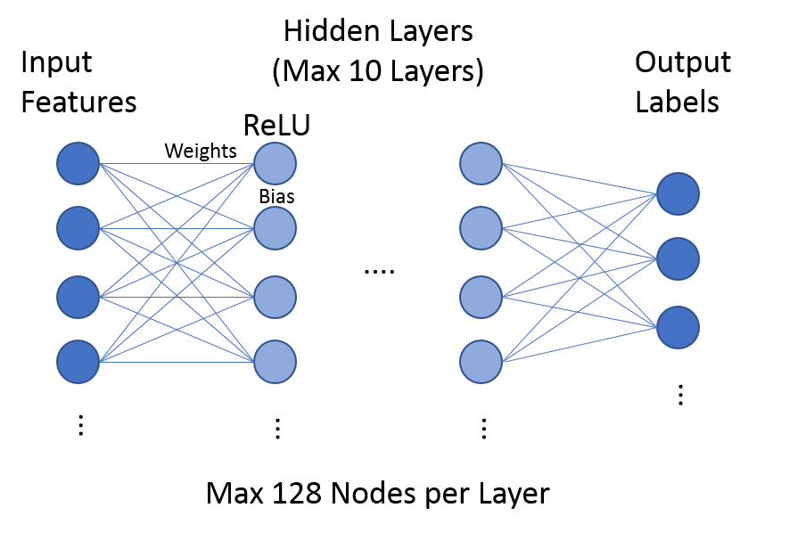

=======================================
Current Acceleration Techniques in AV1
=======================================

AV1 uses many methods to speed up the encoder, including SIMD, multi-threading, different speed modes, and statistics and machine learning strategies. In this section, we will present a short discussion of these features.

-----------------
Speed Feature
-----------------

AV1 offers different speed modes called speed features that allows users to accelerate the encoding speed depending on the requirement of the video quality. Higher speed modes will skip some encoding tools directly.

------------------------- 
Statistic Approaches
------------------------- 

Unlike speed features, which turn off some prediction tools entirely, statistic and machine learnig approaches use intermediate encoding data to select suitable coding tools for the input block.                                         

fp_mb_stats
```````````````
When enabling first pass, the square partition search will be executed and the statistic information of motion vector is used to decide if we should skip none partition directly. This is realized by using the motion vectors of neighboring blocks to evaluate the complexity of current block

-------------------------------- 
Machine Learning Approaches
-------------------------------- 

In AV1, many pruning functions are driven by the machine learning. It is applied in partition mode decisions, prediction and transform mode selection. All these functions share the same simple neural network structure as shown in the Figure below. Although it allows maximum 10 layers and 128 nodes per hidden layer. All the models used in AV1 only contain 1 or 2 hidden layers and 16 to 64 nodes per layer. All the functions' weights and bias are pre stored in the source file.





.. list-table:: Comparison
   :widths: 5 5 5 5 5 5 5
   :header-rows: 1

   * - Video Frame
     - Resolution
     - QP
     - Encoder
     - PSNR(dB)
     - bit
     - Encoding Time
   * - 
     - 
     -
     - AV1
       CNN-AV1
     -
     -
     -
     
--------------------------
Reduced Algorithm
--------------------------

Besides maximizing parallelism among all data level (GOP, Frame, Tiles, Blocks), the other main strategy is to lower the complexity of encoder algorithm itself.
Rate-Distortion cost calculation needs to go through transform/quantization and inverse quantization/inverse transform and these recursive steps account for most of encoding time. Some researches use simplified RD cost calculation such as absolute transformed differences (SATD) to reduce the complexity\cite{Yu-MingLee2010}. Normally These strategies are not related to the contents of input video.
