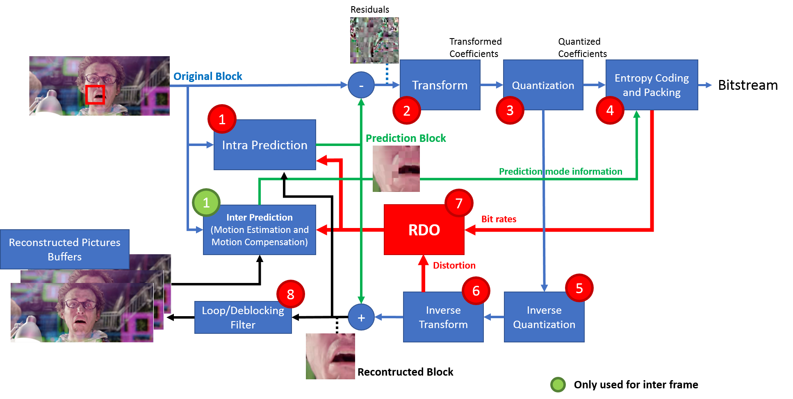

Encoder and Decoder
===================================

=========
Encoder
=========
Most modern video codecs share very similar structure, as shown in Figure :ref:`Encoder`. The encoding process is block-based. Each frame of the input video is sequentially encoded starting from the block in the upper left corner. **Each block** goes through all the steps in the figure to find the best encoding mode.

Prediction tools can be divided into intra and inter prediction. Intra prediction tools are used to eliminate the spatial redundancy in the same frame. It uses edge pixels of adjacent block (left and above) as reference for prediction. Inter prediction tools are used to eliminate temporal redundancy in the video. It searches similar pattern in the same frame or other encoded frame (reference frame) for prediction. The first frame or key frame can only be intra frame, which means it can only use intra prediction. For inter frame, it will try both inter and intra predictions.  Redundancy removal is done by subtracting the original block with prediction block built by predictor and only store the differences. These differences are called residuals. 

The residuals generated from each prediction mode are transformed from space domain to frequency domain to obtain transformed coefficients.

Step 3, the quantizer will eliminate the high frequency information of the block, since human eyes are less sensitive to these information. However, this step will cause irreversible quality loss of the original image. Then the quantized coefficients and other required parameters of this prediction mode are encoded with entropy coding to generate a real bitstream and obtain the bit rate, as step 4. Entropy coding uses symbols to represent certain length of bitstream, which can further compress the bitstream.

To obtain the real distortion of the block, the quantized coefficients are processed with inverse quantization and inverse transform as step 5 and 6.

And step 7 is to calculate the rate-distortion (RD) cost. The formula is shown below: 

Step 1 to 7 will be repeated for all prediction modes to find the best RD cost for each block. This process is often called rate-distortion optimization (RDO). The prediction mode with the lowest RD cost will be selected and the bitstream generated in step 4 will be used in the final output bitstream. 

However, each block be divided into smaller blocks. For each sub-block, the steps above will be repeated again. When the sum of the RD cost of all the sub-blocks is smaller, then the encoder will use this splitting mode (partition mode) for the final output bitstream.

And finally, after the whole frame is encoded, loop/deblock filter is used to remove the ringing effect, which is the side effect of the block based encoding. Then the frame will be used as a reference frame for the next frame. This process is repeated until all the frames in the video are encoded.

.. _Encoder:

    Encoding Process

=========
Decoder
=========

Figure :ref:`Decoder` shows the general decoding process. It can be easily recognized that decoding process is just part of the encoding process. The bitstream will first be unpacked and entropy decoded. The restored residuals are obtained through inverse quantization and inverse transform (In encoder, these steps are required to obtain the real distortion for RD cost calculation). On the other hand, the prediction mode information are also parsed to build the prediction block followed by the addition of the residuals to restore the block. Finally, like in the encoding process, loop/deblocking filter is used to remove the ringing effect. The decoded frame are output as the video stream and also used for decoding next frame.

.. _Decoder:
.. image:: img/DecodingProcess.png
     
     Decoding Process

