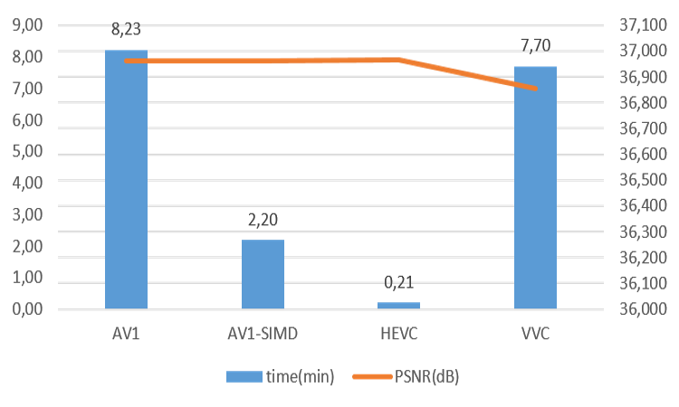
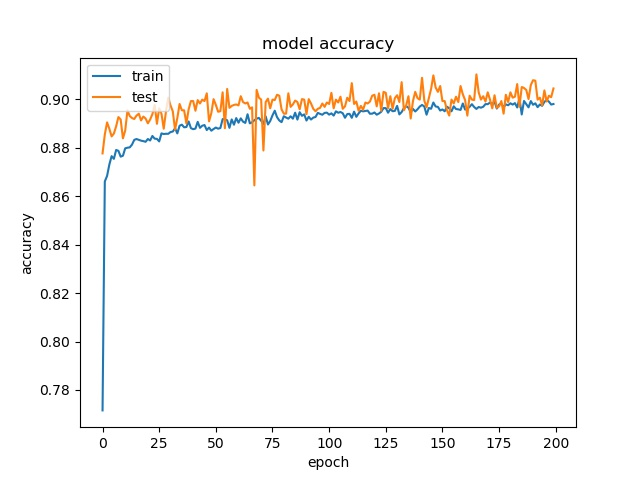

Performance Evaluation
===========================

================================
Experimental Configuration
================================

The video encoding time is measured on Intel NUC

==========================================================
Performance of Reference AV1 Encoder Compared with HEVC
==========================================================

In this section we test the performance of AV1 compared to HEVC and VVC for intra frame encoding. 

All the encoding modes are set to fixed qp. To fairly compare the encoding time for the same PSNR quality, qp is carefully chosen for the three codec. The range of qp for AV1 is 1-64 while it is 1-51 for HEVC and VVC. 

The command is shown below.

Figure below shows the results of the comparison  

It can be seen that for AV1, the encoding time can be greatly improved with SIMD. However, the encoding time is still slower than HEVC and VVC. 

To compare the performance.

The frame is encoded with QPs = 31, 39, 47, and 55 for AV1 and 27, 32, 37, and 42 for HEVC and VVC.

The figure of bit-rate VS PSNR is shown below.

The BD-BR and BD-PSNR is summerized in the table below

It can be seen that the performance of AV1 is better than HEVC but lower than VVC.   

=================================================
Evaluation of CNN models with different data set
=================================================

In the following sections, the dataset with 11 frames with single qp is used for evaluating the performance of different models. All 11 frames are from different videos. For 64 and 32 blocks, the image will be down-scaled to 16x16 first. The rest structure of the model remains the same for each model.

datasets for 64 and 32 block are smaller than 16 block.

The distribution of partition modes of different block sizes is shown below. 

.. image:: img/4K_11f_mix_distribution_64.jpg
   :width: 49%  
.. image:: img/4K_11f_mix_distribution_32.jpg
   :width: 49%

   
------------------------------------------------------
Training Results with 4K full dataset with 11 frames
------------------------------------------------------

We first train the model with the full dataset directly.

The training result with full dataset for block size 16x16, 32x32, 64x64 is shown below:

block size : 64x64

.. image:: img/m1_qp120_64_acc_f.jpg
   :width: 49%

.. image:: img/mnist_qp120_64_acc_f.jpg
   :width: 49%
.. image:: img/mnist_qp120_64_loss_f.jpg
   :width: 49%

**(top) model 1, (bottom) model 2** 

----

block size : 32x32

.. image:: img/m1_qp120_32_acc_sh.jpg
   :width: 49%

.. image:: img/mnist_qp120_32_acc_sh.jpg
   :width: 49%

**(top) model 1, (bottom) model 2** 

Here it can be seen that model2 start overfitting after 20 epochs, this is not because insufficient data but the imbalanced data, that cause the model starts to fit the training dataset. Two possible reasons for the encoder to stay at 65% accuracy. One is the model only learn the distribution. The reason that is not because insufficient data but imbalanced data is the following training with less data doesn't show overfitting 
----

block size : 16x16

.. image:: img/m1_qp120_16_loss_f.jpg
   :width: 49%

This needs to be checked again, since the higher accuracy but higher loss 

.. image:: img/mnist_qp120_16_acc_f.jpg
   :width: 49%

   
**(top) model 1, (bottom) model 2** 

----

It can be seen that the accuray is quite close to the highest distribution of classes for both models.

When using this model to predict a new frame, the prediction result is shown below.

The model mostly guess only split mode for block 64x64 and none and split modes for 32x32 and mostly none for 16x16.

In order to avoid biased model due to the imbalanced data set. The other two strategies are used to correct this problem.

First one is to add a weight for cross entropy for each class to comprehend for the class with less data. Second one is to trim the data set so that every class has equal number of samples.

Training Results with weighted cross entropy 
^^^^^^^^^^^^^^^^^^^^^^^^^^^^^^^^^^^^^^^^^^^^^^

To compensate the imbalanced dataset, weights are given to different classes. The weights are inverse propotional to the number of samples of each class. This means when a false prediction on the class with less samples, the cross entropy will be much higher to adjust the parameters.  

The actual number is showing below:

64x64 {0: 8.74, 1: 36.4, 2: 33.82, 3: 1, 4: 132.52, 5: 112.28, 6: 188., 7: 109.24, 8: 63.65, 9: 53.18}

32x32 {0: 1.55, 1: 6.87, 2: 7.47, 3: 1, 4: 21.73, 5: 21.2, 6: 23.74, 7: 23.61, 8: 9.64, 9: 11.74} 

16x16 {0: 1., 1: 5.77, 2: 6.29, 3: 11.74, 4: 28.27, 5: 37.52, 6: 28.54, 7: 37.04, 8: 14.1, 9: 15.53} 

64

model1

.. image:: img/m1_qp120_64_acc_fw.jpg
    :width: 49%

model2

.. image:: img/mnist_qp120_64_acc_fw.jpg
    :width: 49%

32

model1

model2

.. image:: img/mnist_qp120_32_acc_fw.jpg
    :width: 49%
.. image:: img/mnist_qp120_32_loss_fw.jpg
    :width: 49%

16

model1

.. image:: img/m1_qp120_16_loss_fw.jpg
    :width: 49%

model2

.. image:: img/mnist_qp120_32_acc_fw.jpg
    :width: 49%
.. image:: img/mnist_qp120_32_loss_fw.jpg
    :width: 49%

It can be observed that the accuracy for all block sizes dropped. The expectation of using weights for different classes is to compensate the classes with less samples. However, it shows the accuracy dropped by almost 20% for all block sizes. This may suggest the model is less biased but still couldn't predict correctly. 

----------------------------------------------------------------------------
Performance with trimmed dataset (equal number of samples for each class)
----------------------------------------------------------------------------

In this method, the dataset is trimmed so that each class can have equal number of samples. 

The training result for block size 16x16, 32x32, 64x64 is shown below:

64

each class has 97 samples

model1

.. image:: img/m1_qp120_64_acc_ecf.jpg
   :width: 49%

model2

.. image:: img/mnist_qp120_64_acc_ecf.jpg
   :width: 49%
.. image:: img/mnist_qp120_64_loss_ecf.jpg
   :width: 49%

32

each class has 1654 samples

model1

.. image:: img/m1_qp120_32_acc_ecf.jpg
   :width: 49%
.. image:: img/m1_qp120_32_loss_ecf.jpg
   :width: 49%
   
model2

16

each class has 5493 samples

model1

.. image:: img/m1_qp120_16_loss_ecf.jpg
   :width: 49%
   
model2

.. image:: img/mnist_qp120_16_loss_ecf.jpg
   :width: 49%

The results show that the accuracy is even lower, around 30% for all block sizes, which means the models can not really learn the features of each class. Two possible reasons are considered. The first possible reason is the patterns of different claases are not unique so the model can not learn correctly. The second possible reason is that both two models offer too less parameters to learn all the features of all 10 classes. 

To clarify the first possible reason, we tear down the datas set to further inspect the relation between classes. Only two classes with equal number of samples are selected to see if the model can tell the difference between classes. 

------------------------------------------------------------
Training results of None and Split partition modes only
------------------------------------------------------------

First, the None and Split classses are tested. The number of samples for both classes is equal.

Notice the output of the model is changed to only two classes, the loss function is also changed binary cross entropy.

64

each class has 2000 samples

model1

.. image:: img/m1_qp120_64_acc_NS.jpg
    :width: 49%

model2

.. image:: img/mnist_qp120_64_acc_NS.jpg
    :width: 49%

32

each class has 25000 samples

model1

.. image:: img/m1_qp120_32_loss_NS.jpg
    :width: 49%

model2

.. image:: img/mnist_qp120_32_acc_NS.jpg
    :width: 49%

Model 2 offers more parameters. After it learns all the required features, it starts to memorize certain features only belongs to this data set, which cause overfitting. on the other side, model 1 has just enough parameters to memorize the correct features.

16

each class has 17500 samples

model1

.. image:: img/m1_qp120_16_acc_NS.jpg
    :width: 49%
.. image:: img/m1_qp120_16_loss_NS.jpg
    :width: 49%

model2

.. image:: img/mnist_qp120_16_acc_NS.jpg
    :width: 49%

The result shows that both models can distinguish these two classes easily. For all three block sizes, the accuray can reach around 90%. This means the model can successfully tell the difference between these two classes.

--------------------------------------------------------  
Training results of Horz and Vert partition modes only
-------------------------------------------------------- 

Next, the Horz and Vert classses are tested. The number of samples for both classes are also the same. 

64

each class has 499 samples

model1

.. image:: img/m1_qp120_64_acc_HV.jpg
    :width: 49%
.. image:: img/m1_qp120_64_loss_HV.jpg
    :width: 49%

model2

.. image:: img/mnist_qp120_64_acc_HV.jpg
    :width: 49%
.. image:: img/mnist_qp120_64_loss_HV.jpg
    :width: 49%

32

each class has 5200 samples

model1

  
model2

    
16

each class has 32500 samples

model1

.. image:: img/m1_qp120_16_acc_HV.jpg
    :width: 49%
.. image:: img/m1_qp120_16_loss_HV.jpg
    :width: 49%

model2

.. image:: img/mnist_qp120_16_acc_HV.jpg
    :width: 49%
.. image:: img/mnist_qp120_16_loss_HV.jpg
    :width: 49%

However, the accuracy is much lower. it can only reach between 55% to 70% for the Horz and Vert datasets.

Around 50% means may suggest the model only guess one class for evey sample.

From the tests above, it can be seen that the model can not really learn the features of some classes.

To clarify the root cause of this result, we train it with deeper and wider model to see if it is due to the model lack of sufficient parameters or it is because the horz and vert classes don't have clear features. 

Thus, the possible reason for low accuracy may due to the pattern encoded with these two partition modes are not unique so the model can not learn very well. Figure shows some patterns of blocks encoded in Vert and Horz partition modes. It seems some patterns are very similar but encoded with different modes. The reason may be that Horz and Vert rely more on the context in the frame (neighbor's data).

Other training results of different combinaion of classes can be found in reference. 

The full dataset can be found online (A jupyter notebook can be used to see the partition modes of the dataset)  

Since None and split is the most important classes, we merge the rest of the classes into one class. The reason is to avoid noises affecting each other. This strategy is to insure none and split can get the most correct prediction. The rest of classes are trained with a sub model to obtain higher accuracy

-------------------------------------------------------- 
Binary Split and the Rest 9 classes
-------------------------------------------------------- 

block size : 64x64

Split has 873 samples, the reast of classes also have 973 samples

----

block size : 32x32

Split has 16479 samples, the reast of classes also have 16479 samples

.. image:: img/m1_qp120_32_loss_SR.jpg
   :width: 49%

----

block size : 16x16

Split has 873 samples, the reast of classes also have 973 samples

.. image:: img/m1_qp120_16_loss_SR.jpg
   :width: 49%

-------------------------------------------------------- 
None and the Rest 8 classes (binary)
-------------------------------------------------------- 

block size : 64x64

None has 776 samples, the reast of classes also have 776 samples

.. image:: img/m1_qp120_64_acc_NR8.jpg
   :width: 49%

----

block size : 32x32

.. image:: img/m1_qp120_32_acc_NR8.jpg
   :width: 49%
.. image:: img/m1_qp120_32_loss_NR8.jpg
   :width: 49%

----

block size : 16x16

.. image:: img/m1_qp120_16_acc_NR8.jpg
   :width: 49%
.. image:: img/m1_qp120_16_loss_NR8.jpg
   :width: 49%

====================================
Performance of CNN Intra Encoder
====================================

---------------------------------------------
Encoding Performance
---------------------------------------------

Comparison of Encoding Time
^^^^^^^^^^^^^^^^^^^^^^^^^^^^^^

**full dataset with weighted cross entropy**

First, let the model learn the distribution of the classes may lead to the closest encoding efficiency to the original encoder. the down side of this solution is every frame has its own distribution. This will make the prediction imprecise. This will lower the performance of the encoder.

**merged classes with binary submodel (really learn the class)**

Second strategy is, merge the classes that can not be recognized easily. If the merged class is chosen, then use a sub model to further predict the partition mode.

Overhead

complexity reduction

.. image:: img/overhead_reduction.png

Comparison of Video Quality
^^^^^^^^^^^^^^^^^^^^^^^^^^^^^^
models trained with different dataset is used to test the encoding efficiency

Here we compare the same 

**full dataset with weighted cross entropy**

**merged classes with binary submodel (really learn the class)**

.. image:: img/encoded_frame.png

.. list-table:: Comparison
   :widths: 5 5 5 5 5 5 5
   :header-rows: 1

   * - Video Frame
     - Resolution
     - QP
     - Encoder
     - PSNR(dB)
     - bit
     - Encoding Time
   * - 
     - 
     -
     - AV1
       CNN-AV1
     -
     -
     -

+---------------+------------+-----+-----------+-----------+-------------+------------------+
|  Video Frame  | Resolution | QP  |  Encoder  |  PSNR(dB) |     bit     | Encoding Time (s)|
+===============+============+=====+===========+===========+=============+==================+
|  Basketball   |  1920x1080 | 30  | - AV1     |   37.5    |             |                  |
|               |            |     | - CNN-AV1 |   36.6    |             |                  |
+---------------+------------+-----+-----------+-----------+-------------+------------------+

