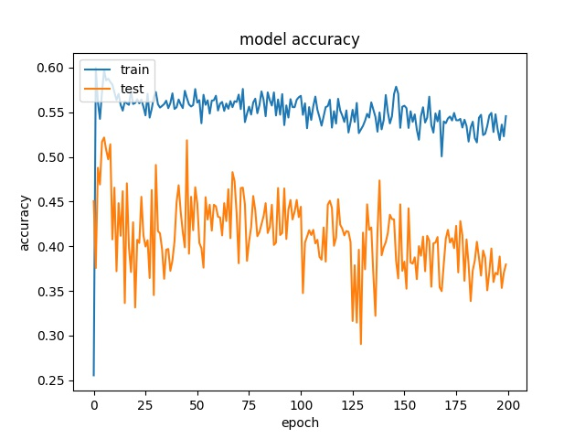
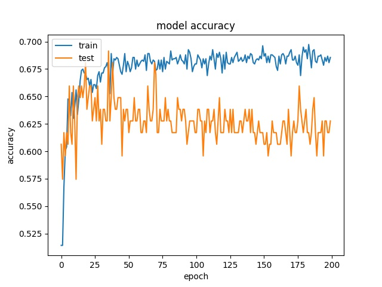
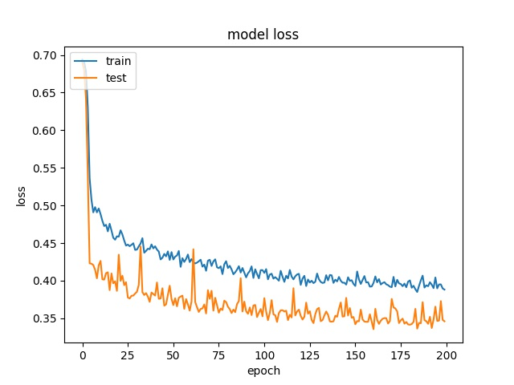

Performance Evaluation
===========================

================================
Experimental Configuration
================================

The video encoding time is measured on Intel NUC

==========================================================
Performance of Reference AV1 Encoder Compared with HEVC
==========================================================

In this section we test the performance of AV1 compared to HEVC and VVC for intra frame encoding. 

All the encoding modes are set to fixed qp. To fairly compare the encoding time for the same PSNR quality, qp is carefully chosen for the three codec. The range of qp for AV1 is 1-64 while it is 1-54 for HEVC and VVC. 

The command is shown below.

Figure below shows the results of the comparison  

It can be seen that for AV1, the encoding time can be greatly improved with SIMD. However, the encoding time is still slower than HEVC and VVC. 

To compare the performance.

The frame is encoded with qp = 25, 30, 36, 42 for AV1 and 16, 25, 32, 42 for HEVC and VVC.

The figure of bit-rate VS PSNR is shown below.

The BD-BR and BD-PSNR is summerized in the table below

It can be seen that the performance of AV1 is better than HEVC but lower than VVC.   

=================================================
Evaluation of CNN models with different dataset
=================================================

In the following sections, the dataset with 11 frames with single qp is used for evaluating the performance of different models. All 11 frames are from different videos. For 64 and 32 blocks, the image will be down-scaled to 16x16 first. The rest structure of the model remains the same for each model.

datasets for 64 and 32 block are smaller than 16 block.

The distribution of partition modes of different block sizes is shown below. 

.. image:: img/4K_11f_mix_distribution_32.jpg
   :width: 49%

.. image:: img/4K_11f_mix_distribution_16.jpg
   :width: 50%
   
-------------------------------------
Performance with full dataset 
-------------------------------------

We first train the model with the full dataset directly.

The training result with full dataset for block size 16x16, 32x32, 64x64 is shown below:

64

model1

.. image:: img/m1_qp120_64_acc_f.jpg
   :width: 49%
.. image:: img/m1_qp120_64_loss_f.jpg
   :width: 49%

model2

.. image:: img/mnist_qp120_64_loss_f.jpg
   :width: 49%

32

model1

.. image:: img/m1_qp120_32_loss_sh.jpg
   :width: 49%

model2

.. image:: img/mnist_qp120_32_loss_sh.jpg
   :width: 49%

16

model1

.. image:: img/m1_qp120_16_acc_f.jpg
   :width: 49%
.. image:: img/m1_qp120_16_loss_f.jpg
   :width: 49%
   
model2

.. image:: img/mnist_qp120_16_loss_f.jpg
   :width: 49%

It can be seen that the accuray is quite close to the highest distribution of classes for both models.

This may suggest the model mostly guess split mode for block 64x64 and none and split modes for 32x32 and mostly none for 16x16.

Part of the prediction result is recored show the model did still predict other modes. 

The other two strategies are used to help the model make correct prediction.

Training with weighted cross entropy 
^^^^^^^^^^^^^^^^^^^^^^^^^^^^^^^^^^^^^^^^^^

To compensate the imbalanced dataset, weights are given to different classes. The weights are inverse propotional to the number of samples of each class. This means when a false prediction on the class with less samples, the cross entropy will be much higher to adjust the parameters.  

64

model1

.. image:: img/m1_qp120_64_loss_fw.jpg
    :width: 49%

model2

.. image:: img/mnist_qp120_64_loss_fw.jpg
    :width: 49%

32

model1

.. image:: img/m1_qp120_32_acc_fw.jpg
    :width: 49%
.. image:: img/m1_qp120_32_loss_fw.jpg
    :width: 49%

model2

.. image:: img/mnist_qp120_32_acc_fw.jpg
    :width: 49%
.. image:: img/mnist_qp120_32_loss_fw.jpg
    :width: 49%

16

model1

.. image:: img/m1_qp120_16_acc_fw.jpg
    :width: 49%

model2

.. image:: img/mnist_qp120_32_acc_fw.jpg
    :width: 49%
.. image:: img/mnist_qp120_32_loss_fw.jpg
    :width: 49%

It can be observed that the accuracy for all the block sizes dropped. The expectation of using weights for different classes is to compensate the classes with less samples. However, it shows the accuracy dropped by almost 20% for all block sizes. There can be two possiblilities. Both two models offers too less parameters to learn all the features of all 10 classes. The other possibility is the patterns of different claases are not unique so the model can not learn correctly. 

To further identify the problem, the dataset is trimmed to make every class has equal number of samples.

----------------------------------------------------------------------------
Performance with trimmed dataset (equal number of samples for each class)
----------------------------------------------------------------------------

To avoid a biased training model, the dataset is trimmed so that each class can have equal samples. 

The training result for block size 16x16, 32x32, 64x64 is shown below:

64

model1

.. image:: img/m1_qp120_64_acc_ecf.jpg
   :width: 49%
.. image:: img/m1_qp120_64_loss_ecf.jpg
   :width: 49%

model2

.. image:: img/mnist_qp120_64_acc_ecf.jpg
   :width: 49%
.. image:: img/mnist_qp120_64_loss_ecf.jpg
   :width: 49%

32

model1

.. image:: img/m1_qp120_32_acc_ecf.jpg
   :width: 49%
.. image:: img/m1_qp120_32_loss_ecf.jpg
   :width: 49%
   
model2

.. image:: img/mnist_qp120_32_acc_ecf.jpg
   :width: 49%
.. image:: img/mnist_qp120_32_loss_ecf.jpg
   :width: 49%

16

model1

.. image:: img/m1_qp120_16_acc_ecf.jpg
   :width: 49%
.. image:: img/m1_qp120_16_loss_ecf.jpg
   :width: 49%
   
model2

.. image:: img/mnist_qp120_16_acc_ecf.jpg
   :width: 49%

To further identify the problem. Only two classes are used to train the model

To further inspect the relation between classes. Only two classes with equal number of samples are selected to see if the model can tell the difference between classes. 

------------------------------------------------------------
Training results of None and Split partition modes only
------------------------------------------------------------

It can be seen that the accuracy can reach around 90% for both models when it is only trained with NONE and SPLIT partition modees.

64

model1

.. image:: img/m1_qp120_64_acc_NS.jpg
    :width: 49%
.. image:: img/m1_qp120_64_loss_NS.jpg
    :width: 49%

model2

.. image:: img/mnist_qp120_64_loss_NS.jpg
    :width: 49%

32

model1

.. image:: img/m1_qp120_32_acc_NS.jpg
    :width: 49%
.. image:: img/m1_qp120_32_loss_NS.jpg
    :width: 49%

model2

.. image:: img/mnist_qp120_32_loss_NS.jpg
    :width: 49%

16

model1

.. image:: img/m1_qp120_16_acc_NS.jpg
    :width: 49%
.. image:: img/m1_qp120_16_loss_NS.jpg
    :width: 49%

model2

.. image:: img/mnist_qp120_16_loss_NS.jpg
    :width: 49%

--------------------------------------------------------  
Training results of Horz and Vert partition modes only
-------------------------------------------------------- 

64

model1

.. image:: img/m1_qp120_64_acc_HV.jpg
    :width: 49%

model2

.. image:: img/mnist_qp120_64_acc_HV.jpg
    :width: 49%
.. image:: img/mnist_qp120_64_loss_HV.jpg
    :width: 49%

32

model1

.. image:: img/m1_qp120_32_acc_HV.jpg
    :width: 49%
.. image:: img/m1_qp120_32_loss_HV.jpg
    :width: 49%
  
model2

.. image:: img/mnist_qp120_32_acc_HV.jpg
    :width: 49%
.. image:: img/mnist_qp120_32_loss_HV.jpg
    :width: 49%
    
16

model1

.. image:: img/m1_qp120_16_acc_HV.jpg
    :width: 49%
.. image:: img/m1_qp120_16_loss_HV.jpg
    :width: 49%

model2

.. image:: img/mnist_qp120_16_acc_HV.jpg
    :width: 49%
.. image:: img/mnist_qp120_16_loss_HV.jpg
    :width: 49%

However, it can only reach 60% for the Horz and Vert datasets.

Around 50% means the model doesn't really learn. The model can always guess only one class and have 50% accuracy.

From the tests above, it can be seen that the model can not really learn the features of some classes. The reason is  

This may suggest the partition Horz and Vert rely more on the context (neighbor's data)

You can check the following jupyter notebook to see to see the partition modes of the dataset.  

Test on Expanded Model
^^^^^^^^^^^^^^^^^^^^^^^

A deeper and wider model is used to test if it is possible to increase the accuracy by offering more parameters.

64

.. image:: img/xl_qp120_64_acc_ecf.jpg
   :width: 49%
.. image:: img/xl_qp120_64_loss_ecf.jpg
   :width: 49%

32

.. image:: img/xl_qp120_32_acc_ecf.jpg
   :width: 49%
.. image:: img/xl_qp120_32_loss_ecf.jpg
   :width: 49%

16

.. image:: img/xl_qp120_16_acc_ecf.jpg
   :width: 49%
.. image:: img/xl_qp120_16_loss_ecf.jpg
   :width: 49%

However, the results show the accuracy is still quite low.

--------------------------------------------------------  
Training results of None and Horz partition modes only
-------------------------------------------------------- 

64

model1

.. image:: img/m1_qp120_64_loss_NH.jpg
    :width: 49%

model2

.. image:: img/mnist_qp120_64_acc_NH.jpg
    :width: 49%
.. image:: img/mnist_qp120_64_loss_NH.jpg
    :width: 49%

32

model1

.. image:: img/m1_qp120_32_acc_NH.jpg
    :width: 49%
.. image:: img/m1_qp120_32_loss_NH.jpg
    :width: 49%
  
model2

.. image:: img/mnist_qp120_32_acc_NH.jpg
    :width: 49%
.. image:: img/mnist_qp120_32_loss_NH.jpg
    :width: 49%
    
16

model1

.. image:: img/m1_qp120_16_acc_NH.jpg
    :width: 49%
.. image:: img/m1_qp120_16_loss_NH.jpg
    :width: 49%

model2

.. image:: img/mnist_qp120_16_acc_NH.jpg
    :width: 49%
.. image:: img/mnist_qp120_16_loss_NH.jpg
    :width: 49%

----------------------------------------------------------------  
Training results of Horz and Split partition modes only
----------------------------------------------------------------  

64

model1

.. image:: img/m1_qp120_64_acc_HS.jpg
    :width: 49%
.. image:: img/m1_qp120_64_loss_HS.jpg
    :width: 49%

model2

.. image:: img/mnist_qp120_64_acc_HS.jpg
    :width: 49%
.. image:: img/mnist_qp120_64_loss_HS.jpg
    :width: 49%

32

model1

.. image:: img/m1_qp120_32_acc_HS.jpg
    :width: 49%
.. image:: img/m1_qp120_32_loss_HS.jpg
    :width: 49%
  
model2

.. image:: img/mnist_qp120_32_acc_HS.jpg
    :width: 49%
.. image:: img/mnist_qp120_32_loss_HS.jpg
    :width: 49%
    
16

model1

.. image:: img/m1_qp120_16_acc_HS.jpg
    :width: 49%
.. image:: img/m1_qp120_16_loss_HS.jpg
    :width: 49%

model2

.. image:: img/mnist_qp120_16_acc_HS.jpg
    :width: 49%
.. image:: img/mnist_qp120_16_loss_HS.jpg
    :width: 49%

--------------------------------------------------------  
Training results of None, Horz and Split partition modes only
-------------------------------------------------------- 

64

model1

.. image:: img/m1_qp120_64_acc_NHS.jpg
    :width: 49%
.. image:: img/m1_qp120_64_loss_NHS.jpg
    :width: 49%

model2

.. image:: img/mnist_qp120_64_acc_NHS.jpg
    :width: 49%
.. image:: img/mnist_qp120_64_loss_NHS.jpg
    :width: 49%

32

model1

.. image:: img/m1_qp120_32_acc_NHS.jpg
    :width: 49%
.. image:: img/m1_qp120_32_loss_NHS.jpg
    :width: 49%
  
model2

.. image:: img/mnist_qp120_32_acc_NHS.jpg
    :width: 49%
.. image:: img/mnist_qp120_32_loss_NHS.jpg
    :width: 49%
    
16

model1

.. image:: img/m1_qp120_16_acc_NHS.jpg
    :width: 49%
.. image:: img/m1_qp120_16_loss_NHS.jpg
    :width: 49%

model2

.. image:: img/mnist_qp120_16_acc_NHS.jpg
    :width: 49%
.. image:: img/mnist_qp120_16_loss_NHS.jpg
    :width: 49%

--------------------------------------------------------  
Training results of Horz4 and Vert4 partition modes only
-------------------------------------------------------- 

64

model1

.. image:: img/m1_qp120_64_loss_HV4.jpg
    :width: 49%

model2

.. image:: img/mnist_qp120_64_acc_HV4.jpg
    :width: 49%
.. image:: img/mnist_qp120_64_loss_HV4.jpg
    :width: 49%

32

model1

.. image:: img/m1_qp120_32_acc_HV4.jpg
    :width: 49%

  
model2

.. image:: img/mnist_qp120_32_acc_HV4.jpg
    :width: 49%
.. image:: img/mnist_qp120_32_loss_HV4.jpg
    :width: 49%
    
16

model1

.. image:: img/m1_qp120_16_acc_HV4.jpg
    :width: 49%

model2

.. image:: img/mnist_qp120_16_acc_HV4.jpg
    :width: 49%
.. image:: img/mnist_qp120_16_loss_HV4.jpg
    :width: 49%

--------------------------------------------------------  
Training results of Split and Horz4 partition modes only
-------------------------------------------------------- 

64

model1

.. image:: img/m1_qp120_64_acc_SH4.jpg
    :width: 49%
.. image:: img/m1_qp120_64_loss_SH4.jpg
    :width: 49%

model2

.. image:: img/mnist_qp120_64_acc_SH4.jpg
    :width: 49%
.. image:: img/mnist_qp120_64_loss_SH4.jpg
    :width: 49%

32

model1

.. image:: img/m1_qp120_32_acc_SH4.jpg
    :width: 49%
.. image:: img/m1_qp120_32_loss_SH4.jpg
    :width: 49%
  
model2

.. image:: img/mnist_qp120_32_acc_SH4.jpg
    :width: 49%

    
16

model1

.. image:: img/m1_qp120_16_acc_SH4.jpg
    :width: 49%
.. image:: img/m1_qp120_16_loss_SH4.jpg
    :width: 49%

model2

.. image:: img/mnist_qp120_16_acc_SH4.jpg
    :width: 49%
.. image:: img/mnist_qp120_16_loss_SH4.jpg
    :width: 49%

--------------------------------------------------------  
Training results of Split and Vert4 partition modes only
-------------------------------------------------------- 

64

model1

.. image:: img/m1_qp120_64_acc_SV4.jpg
    :width: 49%
.. image:: img/m1_qp120_64_loss_SV4.jpg
    :width: 49%

model2

.. image:: img/mnist_qp120_64_acc_SV4.jpg
    :width: 49%
.. image:: img/mnist_qp120_64_loss_SV4.jpg
    :width: 49%

32

model1

.. image:: img/m1_qp120_32_acc_SV4.jpg
    :width: 49%
.. image:: img/m1_qp120_32_loss_SV4.jpg
    :width: 49%
  
model2

.. image:: img/mnist_qp120_32_acc_SV4.jpg
    :width: 49%
.. image:: img/mnist_qp120_32_loss_SV4.jpg
    :width: 49%
    
16

model1

.. image:: img/m1_qp120_16_acc_SV4.jpg
    :width: 49%
.. image:: img/m1_qp120_16_loss_SV4.jpg
    :width: 49%

model2

.. image:: img/mnist_qp120_16_acc_SV4.jpg
    :width: 49%
.. image:: img/mnist_qp120_16_loss_SV4.jpg
    :width: 49%

----------------------------------------------------------------  
Training results of Split, Horz4 and Vert4 partition modes only
----------------------------------------------------------------  

64

model1

.. image:: img/m1_qp120_64_acc_SHV4.jpg
    :width: 49%
.. image:: img/m1_qp120_64_loss_SHV4.jpg
    :width: 49%

model2

.. image:: img/mnist_qp120_64_acc_SHV4.jpg
    :width: 49%
.. image:: img/mnist_qp120_64_loss_SHV4.jpg
    :width: 49%

32

model1

.. image:: img/m1_qp120_32_acc_SHV4.jpg
    :width: 49%
.. image:: img/m1_qp120_32_loss_SHV4.jpg
    :width: 49%
  
model2

.. image:: img/mnist_qp120_32_acc_SHV4.jpg
    :width: 49%
.. image:: img/mnist_qp120_32_loss_SHV4.jpg
    :width: 49%
    
16

model1

.. image:: img/m1_qp120_16_loss_SHV4.jpg
    :width: 49%

model2

.. image:: img/mnist_qp120_16_acc_SHV4.jpg
    :width: 49%
.. image:: img/mnist_qp120_16_loss_SHV4.jpg
    :width: 49%

----------------------------------------------------------------  
Training results of HorzA and HorzB partition modes only
----------------------------------------------------------------  

64

model1

.. image:: img/m1_qp120_64_acc_HAB.jpg
    :width: 49%
.. image:: img/m1_qp120_64_loss_HAB.jpg
    :width: 49%

model2

.. image:: img/mnist_qp120_64_loss_HAB.jpg
    :width: 49%

32

model1

.. image:: img/m1_qp120_32_acc_HAB.jpg
    :width: 49%
.. image:: img/m1_qp120_32_loss_HAB.jpg
    :width: 49%
  
model2

.. image:: img/mnist_qp120_32_acc_HAB.jpg
    :width: 49%
.. image:: img/mnist_qp120_32_loss_HAB.jpg
    :width: 49%
    
16

model1

.. image:: img/m1_qp120_16_acc_HAB.jpg
    :width: 49%
.. image:: img/m1_qp120_16_loss_HAB.jpg
    :width: 49%

model2

.. image:: img/mnist_qp120_16_acc_HAB.jpg
    :width: 49%
.. image:: img/mnist_qp120_16_loss_HAB.jpg
    :width: 49%

--------------------------------------
Performance with Larger Dataset
--------------------------------------
We further use dataset mixed with data from different resolution.

datasets from videos with other resolution
^^^^^^^^^^^^^^^^^^^^^^^^^^^^^^^^^^^^^^^^^^^

It can be seen in the figure, that videos with different resolution have slightly different partition mode distributions. For lower resolution videos, there is higher chance to be encoded in smaller blocks since the contents of the video is more compact. 

Videos with higher resolution like 4K videos, on the other hand, will have more smooth area that can be encoded with larger blocks.

It can be seen that the accuracy is becoming lower with larger dataset, which may suggest the model is more confused by the dataset.

---------------------------------------------
Comparison between seperate qp and mixed qps
---------------------------------------------

From figure x, it can be seen that qp affect the partition decision tremendously. 

.. image:: img/library64.jpg
    :width: 49%
.. image:: img/library32.jpg
    :width: 49%

.. image:: img/library16.jpg
    :width: 49%

Models trained with single qp (120) and mixed qp data are tested with a test set including one 4K frame, 

---------------------------------------------
Summary
---------------------------------------------

In real cases, let the model learn the distribution of the classes may lead to the closest encoding efficiency to the original encoder.

====================================
Performance of CNN Intra Encoder
====================================

---------------------------------------------
Encoding Performance
---------------------------------------------

Comparison of Encoding Time
^^^^^^^^^^^^^^^^^^^^^^^^^^^^^^
Overhead

Comparison of Video Quality
^^^^^^^^^^^^^^^^^^^^^^^^^^^^^^
models trained with different dataset is used to test the encoding efficiency

Here we compare the same 

trimmed dataset

The figure below show

full dataset

full dataset with weighted cross entropy

