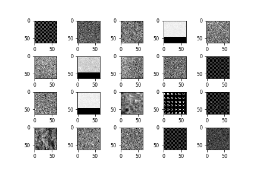
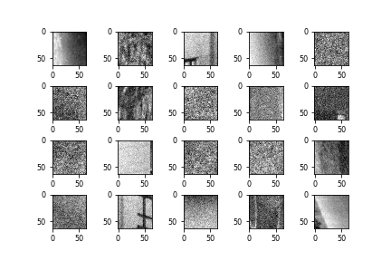
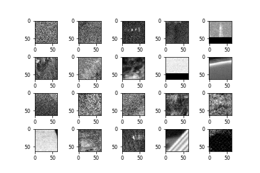
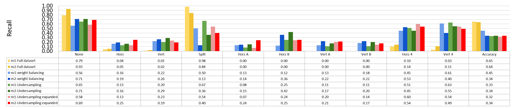
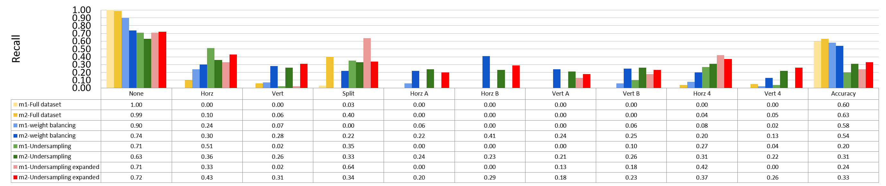
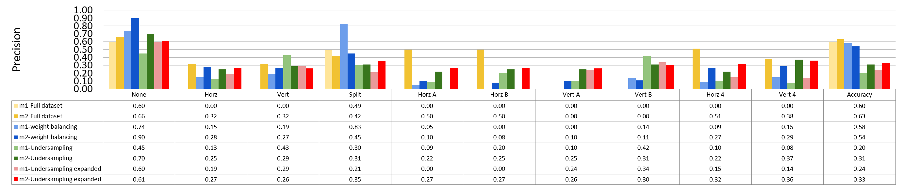
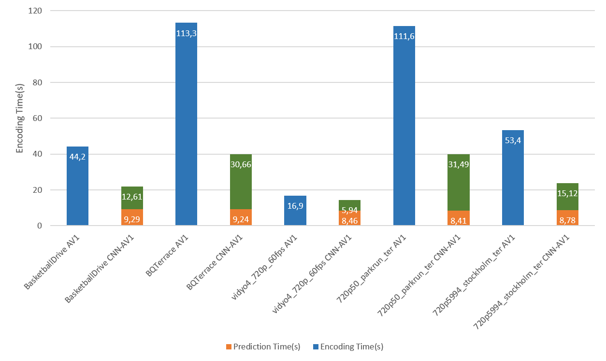

Performance Evaluation
===========================

================================
Experimental Configuration
================================

The video encoding time is measured on Intel NUC

==========================================================
Performance of Reference AV1 Encoder Compared with HEVC
==========================================================

In this section we test the performance of AV1 compared to HEVC and VVC for intra frame encoding. 

All the encoding modes are set to fixed qp. To fairly compare the encoding time for the same PSNR quality, qp is carefully chosen for the three codec. The range of qp for AV1 is 1-64 while it is 1-51 for HEVC and VVC. 

The command is shown below.

Figure below shows the results of the comparison  

.. figure:: img/encoding_time.png
   :width: 60%
   :align: center
   
   comparison of encoding time with similar PSNR (one 1080p frame)

It can be seen that for AV1, the encoding time can be greatly improved with SIMD. However, the encoding time is still slower than HEVC HM. It is 10 times slower than HEVC HM even with SIMD acceleration. Notice that the encoding time of AV1 without SIMD is very close to VVC.  

To compare the compression efficiency, one 1080p video frame is encoded with QPs = 31, 39, 47, and 55 for AV1 and 27, 32, 37, and 42 for HEVC and VVC to evaluate the BD-BR and BD-PSNR.

The figure of bit-rate VS PSNR is shown below.

.. figure:: img/comparison.png
   :width: 60%
   :align: center
   
   bit-rate VS PSNR

It can be seen that the performance of AV1 is better than HEVC but lower than VVC.   

The BD-BR and BD-PSNR of AV1 compared to HEVC HM in the table below

+--------------------------------------+
|         Baseline: HEVC HM            |
+-------------+------------+-----------+ 
|  Encoder    | BD-PSNR(dB)|  BD-BR(%) | 
+=============+============+===========+ 
|    AV1      |            |           | 
+-------------+------------+-----------+

=====================
Analysis of Dataset
=====================

In the following sections, the dataset with 11 frames with single qp is used for evaluating the performance of different models. All 11 frames are from different videos. For 64 and 32 blocks, the image will be down-scaled to 16x16 first. The rest structure of the model remains the same for each model.

datasets for 64 and 32 block are smaller than 16 block.

The distribution of partition modes of different block sizes is shown below. 

.. image:: img/4K_11f_mix_distribution_64.jpg
   :width: 49%  
.. image:: img/4K_11f_mix_distribution_32.jpg
   :width: 49%

.. image:: img/4K_11f_mix_distribution_16.jpg
   :width: 50%

Some raw 64x64 images of each partition mode is shown below:

.. image:: img/partition3.png
   :width: 49%   

(left) None, (right) Split

It can be seen that blocks encoded with none are simpler and blocks encoded in Split mode have more complicated patterns. 

.. image:: img/partition1.png
   :width: 49%

(left) Horizontal, (right) Vertical

These two classes don't have very clearer differences visually

.. image:: img/partition5.png
   :width: 49%

(left) Horizontal A, (right) Horizontal B

These two classes don't have very clearer differences visually

   
   
(left) Vertical A, (right) Vertical B

These two classes don't have very clearer differences visually

(left) Horizontal 4, (right) Vertical 4

These two classes don't have more clearer differences.

Overall, it can be seen that some classes show very similar patterns, which may be difficult for the model to classify them.

------------------------------- 
Visualization Through t-SNE
-------------------------------

t-SNE can project high dimentional vector into 3D or 2D dimention. The tool is available in Tensorboard.

-----------------
What if Tool
-----------------

WIT can be used in two ways. One is using Jypter notebook and trained model using Tensorflow Estimator.
The other way is to use Tensorboard. In this way we need to use Tensorflow Serving and TFRecord.

------------------------------------
Kernal Map/Feature map Visualization
------------------------------------

After training, weights in kernal map have been changed, checking the pattern of the kernal map may gives us the clue of what the model actually learns.

Feature maps are obtained after applying kernal maps on the image, so it can revreal the pattern the model sees.

One way to achieve this is to through autoencoder.

=================================================
Evaluation of CNN models with different dataset
=================================================

------------------------------------------------------
Training Results with 4K full dataset with 11 frames
------------------------------------------------------

We first train the model with the full dataset directly.

The training result with full dataset for block size 16x16, 32x32, 64x64 is shown below:

block size : 64x64

----

block size : 32x32

Here it can be seen that model2 start overfitting after 20 epochs, this is not because insufficient data but the imbalanced data, that cause the model starts to fit the training dataset. Two possible reasons for the encoder to stay at 65% accuracy. One is the model only learn the distribution. The reason that is not because insufficient data but imbalanced data is the following training with less data doesn't show overfitting 

----

block size : 16x16

----

It can be seen that the accuray is quite close to the highest distribution of classes for both models.

When using this model to predict a new frame, the prediction result is shown below.

The model mostly guess only split mode for block 64x64 and none and split modes for 32x32 and mostly none for 16x16.

+----------------+-------------+-------------+---------+
| Partition Mode | Prescision  | Recall      | Samples |
|                +------+------+------+------+         |
|                | m1   | m2   | m1   | m2   |         |
+----------------+------+------+------+------+---------+
|      None      |  0.6 | 0.66 |    1 | 0.99 |   20594 |
+----------------+------+------+------+------+---------+
|      Horz      |    0 | 0.32 |    0 |  0.1 |    3647 |
+----------------+------+------+------+------+---------+
|      Vert      |    0 | 0.32 |    0 | 0.06 |    3250 |
+----------------+------+------+------+------+---------+
|      Split     | 0.44 | 0.42 | 0.06 |  0.4 |    1762 |
+----------------+------+------+------+------+---------+
|     Horz A     |    0 |  0.5 |    0 |    0 |     699 |
+----------------+------+------+------+------+---------+
|     Horz B     |    0 |  0.5 |    0 |    0 |     577 |
+----------------+------+------+------+------+---------+
|     Vert A     |    0 |    0 |    0 |    0 |     730 |
+----------------+------+------+------+------+---------+
|     Vert B     |    0 |    0 |    0 |    0 |     565 |
+----------------+------+------+------+------+---------+
|     Horz 4     |    0 | 0.51 |    0 | 0.04 |    1479 |
+----------------+------+------+------+------+---------+
|     Vert 4     |    0 | 0.38 |    0 | 0.05 |    1269 |
+----------------+------+------+------+------+---------+
| Total Accuracy |  0.6 | 0.63 |  0.6 | 0.63 |   34572 |
+----------------+------+------+------+------+---------+

+----------------+-------------+-------------+---------+
| Partition Mode | Prescision  | Recall      | Samples |
|                +------+------+------+------+         |
|                | m1   | m2   | m1   | m2   |         |
+----------------+------+------+------+------+---------+
|      None      | 0.69 | 0.52 | 0.79 | 0.93 |    2477 |
+----------------+------+------+------+------+---------+
|      Horz      | 0.66 | 0.43 | 0.04 | 0.05 |     547 |
+----------------+------+------+------+------+---------+
|      Vert      | 0.44 | 0.23 | 0.01 | 0.02 |     551 |
+----------------+------+------+------+------+---------+
|      Split     | 0.65 | 0.79 | 0.98 | 0.84 |    3925 |
+----------------+------+------+------+------+---------+
|     Horz A     | 0.00 | 0.00 | 0.00 | 0.00 |     165 |
+----------------+------+------+------+------+---------+
|     Horz B     | 0.00 | 0.00 | 0.00 | 0.00 |     182 |
+----------------+------+------+------+------+---------+
|     Vert A     | 0.00 | 0.00 | 0.00 | 0.00 |     178 |
+----------------+------+------+------+------+---------+
|     Vert B     | 0.00 | 0.00 | 0.00 | 0.00 |     158 |
+----------------+------+------+------+------+---------+
|     Horz 4     | 0.31 | 0.41 | 0.10 | 0.14 |     427 |
+----------------+------+------+------+------+---------+
|     Vert 4     | 0.60 | 0.45 | 0.03 | 0.11 |     357 |
+----------------+------+------+------+------+---------+
| Total Accuracy | 0.65 | 0.64 | 0.65 | 0.64 |    8967 |
+----------------+------+------+------+------+---------+

In order to avoid biased model due to the imbalanced data set. The other two strategies are used to correct this problem.

First one is to add a weight for cross entropy for each class to comprehend for the class with less data. Second one is to trim the data set so that every class has equal number of samples.

Training Results with weighted cross entropy 
^^^^^^^^^^^^^^^^^^^^^^^^^^^^^^^^^^^^^^^^^^^^^^

To compensate the imbalanced dataset, weights are given to different classes. The weights are inverse propotional to the number of samples of each class. This means when a false prediction on the class with less samples, the cross entropy will be much higher to adjust the parameters.  

The actual number is showing below:

64x64 {0: 8.74, 1: 36.4, 2: 33.82, 3: 1, 4: 132.52, 5: 112.28, 6: 188., 7: 109.24, 8: 63.65, 9: 53.18}

32x32 {0: 1.55, 1: 6.87, 2: 7.47, 3: 1, 4: 21.73, 5: 21.2, 6: 23.74, 7: 23.61, 8: 9.64, 9: 11.74} 

16x16 {0: 1., 1: 5.77, 2: 6.29, 3: 11.74, 4: 28.27, 5: 37.52, 6: 28.54, 7: 37.04, 8: 14.1, 9: 15.53} 

64

model1

.. image:: img/m1_qp120_64_acc_fw.jpg
    :width: 49%
.. image:: img/m1_qp120_64_loss_fw.jpg
    :width: 49%

model2

.. image:: img/mnist_qp120_64_acc_fw.jpg
    :width: 49%
.. image:: img/mnist_qp120_64_loss_fw.jpg
    :width: 49%

32

model1

.. image:: img/m1_qp120_32_acc_fw.jpg
    :width: 49%
.. image:: img/m1_qp120_32_loss_fw.jpg
    :width: 49%

model2

.. image:: img/mnist_qp120_32_acc_fw.jpg
    :width: 49%
.. image:: img/mnist_qp120_32_loss_fw.jpg
    :width: 49%

16

model1

.. image:: img/m1_qp120_16_acc_fw.jpg
    :width: 49%
.. image:: img/m1_qp120_16_loss_fw.jpg
    :width: 49%

model2

.. image:: img/mnist_qp120_32_acc_fw.jpg
    :width: 49%
.. image:: img/mnist_qp120_32_loss_fw.jpg
    :width: 49%

It can be observed that the accuracy for all block sizes dropped. The expectation of using weights for different classes is to compensate the classes with less samples. However, it shows the accuracy dropped by almost 20% for all block sizes. This may suggest the model is less biased but still couldn't predict correctly. 

----------------------------------------------------------------------------
Performance with trimmed dataset (equal number of samples for each class)
----------------------------------------------------------------------------

In this method, the dataset is trimmed so that each class can have equal number of samples. 

The training result for block size 16x16, 32x32, 64x64 is shown below:

64

each class has 97 samples

model1

.. image:: img/m1_qp120_64_acc_ecf.jpg
   :width: 49%
.. image:: img/m1_qp120_64_loss_ecf.jpg
   :width: 49%

model2

.. image:: img/mnist_qp120_64_acc_ecf.jpg
   :width: 49%

32

each class has 1654 samples

model1

   
model2

.. image:: img/mnist_qp120_32_acc_ecf.jpg
   :width: 49%
.. image:: img/mnist_qp120_32_loss_ecf.jpg
   :width: 49%

16

each class has 5493 samples

model1

.. image:: img/m1_qp120_16_acc_ecf.jpg
   :width: 49%

   
model2

.. image:: img/mnist_qp120_16_acc_ecf.jpg
   :width: 49%
.. image:: img/mnist_qp120_16_loss_ecf.jpg
   :width: 49%

The results show that the accuracy is even lower, around 30% for all block sizes, which means the models can not really learn the features of each class. Two possible reasons are considered. The first possible reason is the patterns of different claases are not unique so the model can not learn correctly. The second possible reason is that both two models offer too less parameters to learn all the features of all 10 classes. 

To clarify the first possible reason, we tear down the datas set to further inspect the relation between classes. Only two classes with equal number of samples are selected to see if the model can tell the difference between classes. 

-------------------------------------------------------- 
Binary Split and the Rest 9 classes
-------------------------------------------------------- 

block size : 64x64

Split has 873 samples, the reast of classes also have 973 samples

.. image:: img/m1_qp120_64_acc_SR.jpg
   :width: 49%
.. image:: img/m1_qp120_64_loss_SR.jpg
   :width: 49%

----

block size : 32x32

Split has 16479 samples, the reast of classes also have 16479 samples

.. image:: img/m1_qp120_32_acc_SR.jpg
   :width: 49%
.. image:: img/m1_qp120_32_loss_SR.jpg
   :width: 49%

----

block size : 16x16

Split has 873 samples, the reast of classes also have 973 samples

.. image:: img/m1_qp120_16_acc_SR.jpg
   :width: 49%
.. image:: img/m1_qp120_16_loss_SR.jpg
   :width: 49%

--------------------------------------------
None and the Rest 8 classes (binary)
-------------------------------------------- 

block size : 64x64

None has 776 samples, the reast of classes also have 776 samples

.. image:: img/m1_qp120_64_loss_NR8.jpg
   :width: 49%

----

block size : 32x32

.. image:: img/m1_qp120_32_acc_NR8.jpg
   :width: 49%
.. image:: img/m1_qp120_32_loss_NR8.jpg
   :width: 49%

----

block size : 16x16

.. image:: img/m1_qp120_16_acc_NR8.jpg
   :width: 49%
.. image:: img/m1_qp120_16_loss_NR8.jpg
   :width: 49%

--------------------------------------- 
Training Results of Rest 7 Classes
--------------------------------------- 

====================================
Performance of CNN Intra Encoder
====================================

--------------------------- 
Encoding Performance
--------------------------- 

Comparison of Encoding Efficiency
^^^^^^^^^^^^^^^^^^^^^^^^^^^^^^^^^^^

.. image:: img/BQ_ori.png

Comparison of Encoding Time
^^^^^^^^^^^^^^^^^^^^^^^^^^^^^^

**full dataset with weighted cross entropy**

First, let the model learn the distribution of the classes may lead to the closest encoding efficiency to the original encoder. the down side of this solution is every frame has its own distribution. This will make the prediction imprecise. This will lower the performance of the encoder.

**merged classes with binary submodel (really learn the class)**

Second strategy is, merge the classes that can not be recognized easily. If the merged class is chosen, then use a sub model to further predict the partition mode.

Overhead

complexity reduction

+------------------------------------+------------+----+--------------+----------+---------+--------------+-----------+----------+
|             Video Frame            | Resolution | QP |    Encoder   | PSNR(dB) |   Bits  |     Bits     | Encoding  |   Time   |
|                                    |            |    |              |          |         | Increased(%) |  Time(s)  | Saved(%) |
+------------------------------------+------------+----+--------------+----------+---------+--------------+-----------+----------+
| BasketballDrive Frame 0            |  1920x1080 | 30 |          AV1 |   40.281 |  311864 |            - |      44.2 |        - |
|                                    |            |    +--------------+----------+---------+--------------+-----------+----------+
|                                    |            |    |      CNN-AV1 |   40.212 |  329624 |         5.69 |      21.9 |     50.5 |
+------------------------------------+------------+----+--------------+----------+---------+--------------+-----------+----------+
| BQTerrace Frame 0                  |  1920x1080 | 30 |          AV1 |   37.867 | 1260496 |            - |     113.3 |        - |
|                                    |            |    +--------------+----------+---------+--------------+-----------+----------+
|                                    |            |    |      CNN-AV1 |   37.599 | 1300448 |         3.17 |      30.2 |     73.3 |
|                                    |            |    | (10 classes) |          |         |              |           |          |
|                                    |            |    +--------------+----------+---------+--------------+-----------+----------+
|                                    |            |    |      CNN-AV1 |   37.855 | 1312248 |         4.11 |      39.9 |     64.8 |
+------------------------------------+------------+----+--------------+----------+---------+--------------+-----------+----------+
| Kimono1 Frame 1                    |  1920x1080 | 30 |          AV1 |   41.829 |  341072 |            - |      51.5 |        - |
|                                    |            |    +--------------+----------+---------+--------------+-----------+----------+
|                                    |            |    |      CNN-AV1 |   41.729 |  349224 |         2.39 |      22.6 |     56.1 |
+------------------------------------+------------+----+--------------+----------+---------+--------------+-----------+----------+
| ParkScene Frame 1                  |  1920x1080 | 30 |          AV1 |   38.834 |  854352 |            - |     112.6 |        - |
|                                    |            |    +--------------+----------+---------+--------------+-----------+----------+
|                                    |            |    |      CNN-AV1 |   38.798 |  885472 |         3.64 |      35.3 |     68.6 |
+------------------------------------+------------+----+--------------+----------+---------+--------------+-----------+----------+
| Tennis Frame 1                     |  1920x1080 | 30 |          AV1 |   41.150 |  311416 |            - |      41.1 |        - |
|                                    |            |    +--------------+----------+---------+--------------+-----------+----------+
|                                    |            |    |      CNN-AV1 |   41.084 |  330040 |         5.98 |      20.5 |     50.1 |
+------------------------------------+------------+----+--------------+----------+---------+--------------+-----------+----------+
| station2 Frame 1                   |  1920x1080 | 30 |          AV1 |   41.444 |  370568 |            - |      50.7 |        - |
|                                    |            |    +--------------+----------+---------+--------------+-----------+----------+
|                                    |            |    |      CNN-AV1 |   41.356 |  390272 |         5.32 |      23.1 |     54.4 |
+------------------------------------+------------+----+--------------+----------+---------+--------------+-----------+----------+
| sunflower Frame 1                  |  1920x1080 | 30 |          AV1 |   44.323 |  242456 |            - |      30.6 |        - |
|                                    |            |    +--------------+----------+---------+--------------+-----------+----------+
|                                    |            |    |      CNN-AV1 |   44.239 |  258280 |         6.52 |      20.4 |     33.3 |
+------------------------------------+------------+----+--------------+----------+---------+--------------+-----------+----------+
| vidyo4_720p_60fps Frame 29         |  1280x720  | 30 |          AV1 |   42.246 |  160760 |            - |      16.9 |        - |
|                                    |            |    +--------------+----------+---------+--------------+-----------+----------+
|                                    |            |    |      CNN-AV1 |   42.124 |  168232 |         4.65 |      14.4 |     14.8 |
+------------------------------------+------------+----+--------------+----------+---------+--------------+-----------+----------+
| 720p50 parkrun ter Frame 2         |  1280x720  | 30 |          AV1 |   36.101 | 1322016 |            - |     111.6 |        - |
|                                    |            |    +--------------+----------+---------+--------------+-----------+----------+
|                                    |            |    |      CNN-AV1 |   36.157 | 1363984 |         3.17 |      39.9 |     64.2 |
+------------------------------------+------------+----+--------------+----------+---------+--------------+-----------+----------+
| 720p5994 stockholm ter Frame 2     |  1280x720  | 30 |          AV1 |   37.368 |  476712 |            - |      53.4 |        - |
|                                    |            |    +--------------+----------+---------+--------------+-----------+----------+
|                                    |            |    |      CNN-AV1 |   37.341 |  496440 |         4.14 |      23.9 |     55.2 |
+------------------------------------+------------+----+--------------+----------+---------+--------------+-----------+----------+
| park_joy_420_720p50 Frame 499      |  1280x720  | 30 |          AV1 |   35.483 | 1680376 |            - |     145.8 |        - |
|                                    |            |    +--------------+----------+---------+--------------+-----------+----------+
|                                    |            |    |      CNN-AV1 |   35.527 | 1714744 |         2.05 |      43.0 |     70.5 |
+------------------------------------+------------+----+--------------+----------+---------+--------------+-----------+----------+
| 720p50_mobcal_ter Frame 500        |  1280x720  | 30 |          AV1 |   39.558 |  325824 |            - |      36.1 |        - |
|                                    |            |    +--------------+----------+---------+--------------+-----------+----------+
|                                    |            |    |      CNN-AV1 |   39.495 |  352544 |         8.20 |      18.9 |     47.6 |
+------------------------------------+------------+----+--------------+----------+---------+--------------+-----------+----------+
| 720p50_shields_ter Frame 2         |  1280x720  | 30 |          AV1 |   37.338 |  689312 |            - |      68.0 |        - |
|                                    |            |    +--------------+----------+---------+--------------+-----------+----------+
|                                    |            |    |      CNN-AV1 |   37.372 |  723784 |         5.00 |      27.2 |     60.0 |
+------------------------------------+------------+----+--------------+----------+---------+--------------+-----------+----------+
| vidyo3_720p_60fps Frame 0          |  1280x720  | 30 |          AV1 |   41.805 |  173888 |            - |      18.1 |        - |
|                                    |            |    +--------------+----------+---------+--------------+-----------+----------+
|                                    |            |    |      CNN-AV1 |   41.666 |  185944 |         6.93 |      15.4 |     14.9 |
+------------------------------------+------------+----+--------------+----------+---------+--------------+-----------+----------+
| KristenAndSara_1280x720_60 Frame 0 |  1280x720  | 30 |          AV1 |   42.725 |  178304 |            - |      16.8 |        - |
|                                    |            |    +--------------+----------+---------+--------------+-----------+----------+
|                                    |            |    |      CNN-AV1 |   42.643 |  189872 |         6.49 |      16.5 |      1.8 |
+------------------------------------+------------+----+--------------+----------+---------+--------------+-----------+----------+
|               Average              |          - |  - |            - |        - |       - |         4.95 |         - |    47.12 |
+------------------------------------+------------+----+--------------+----------+---------+--------------+-----------+----------+

If predictions for 16x16 blocks are disabled, all the videos can be encoded successfully (Some prediction for 16x16 blocks will cause overflow in transform).

+-----------------------------+------------+----+---------+----------+---------+---------------+-----------+---------------+
|         Video Frame         | Resolution | QP | Encoder | PSNR(dB) |   Bits  |     Bits      | Encoding  |     Time      |
|                             |            |    |         |          |         |  Increased(%) |  Time(s)  |    Saved(%)   |
+-----------------------------+------------+----+---------+----------+---------+---------------+-----------+---------------+
| YachtRide Frame 0           |  3840x2160 | 30 |     AV1 |   43.183 |  895128 |             - |    104611 |             - |
|                             |            |    +---------+----------+---------+---------------+-----------+---------------+
|                             |            |    | CNN-AV1 |   43.102 |  929656 |          3.86 |     49302 | 52.8711129805 |
+-----------------------------+------------+----+---------+----------+---------+---------------+-----------+---------------+
| ReadySteadyGo Frame 0       |  3840x2160 | 30 |     AV1 |   40.930 | 1547176 |             - |    177540 |             - |
|                             |            |    +---------+----------+---------+---------------+-----------+---------------+
|                             |            |    | CNN-AV1 |   40.893 | 1590984 |   2.831481357 |     74780 | 57.8799143855 |
+-----------------------------+------------+----+---------+----------+---------+---------------+-----------+---------------+
| HoneyBee_3840x2160 Frame 0  |  3840x2160 | 30 |     AV1 |   40.026 |  796888 |             - |    171061 |             - |
|                             |            |    +---------+----------+---------+---------------+-----------+---------------+
|                             |            |    | CNN-AV1 |   39.992 |  820960 |  3.0207507203 |     49784 |  70.896931504 |
+-----------------------------+------------+----+---------+----------+---------+---------------+-----------+---------------+
| ShakeNDry_3840x2160 Frame 0 |  3840x2160 | 30 |     AV1 |   39.856 | 1258320 |             - |    238588 |             - |
|                             |            |    +---------+----------+---------+---------------+-----------+---------------+
|                             |            |    | CNN-AV1 |   39.798 | 1270784 |  0.9905270519 |     64885 | 72.8045836337 |
+-----------------------------+------------+----+---------+----------+---------+---------------+-----------+---------------+
| in_to_tree_2160p50 Frame 0  |  3840x2160 | 30 |     AV1 |   36.342 | 2949760 |             - |    503017 |             - |
|                             |            |    +---------+----------+---------+---------------+-----------+---------------+
|                             |            |    | CNN-AV1 |   36.115 | 2775680 | -5.9014970709 |    106941 | 78.7400823431 |
+-----------------------------+------------+----+---------+----------+---------+---------------+-----------+---------------+
| Cactus_1920x1080_50 Frame 1 |  1920x1080 | 30 |     AV1 |   38.126 |  803040 |             - |    106912 |             - |
|                             |            |    +---------+----------+---------+---------------+-----------+---------------+
|                             |            |    | CNN-AV1 |   38.114 |  815960 |  1.6088862323 |     67020 | 37.3129302604 |
+-----------------------------+------------+----+---------+----------+---------+---------------+-----------+---------------+
| blue_sky_1080p25 Frame 216  |  1920x1080 | 30 |     AV1 |   38.769 | 1581104 |             - |    165020 |             - |
|                             |            |    +---------+----------+---------+---------------+-----------+---------------+
|                             |            |    | CNN-AV1 |   38.777 | 1589296 |  0.5181189852 |    114239 | 30.7726336202 |
+-----------------------------+------------+----+---------+----------+---------+---------------+-----------+---------------+
|           Average           |          - |  - |       - |        - |       - |  0.9893703869 |         - | 57.3254555325 |
+-----------------------------+------------+----+---------+----------+---------+---------------+-----------+---------------+

