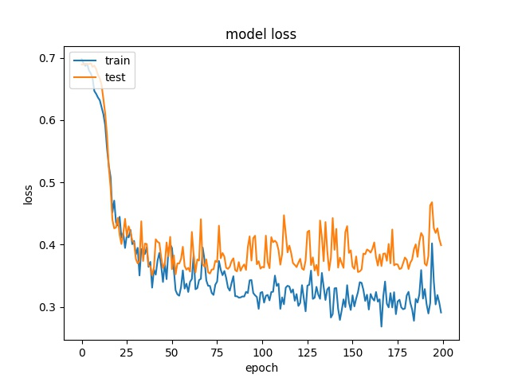
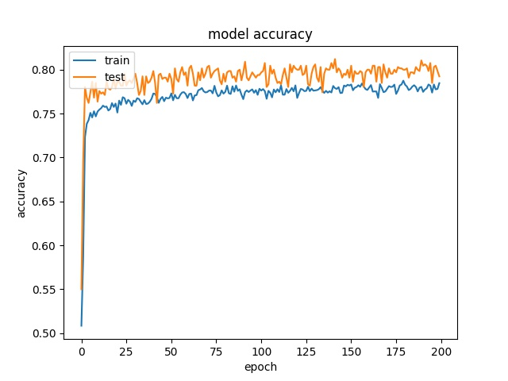
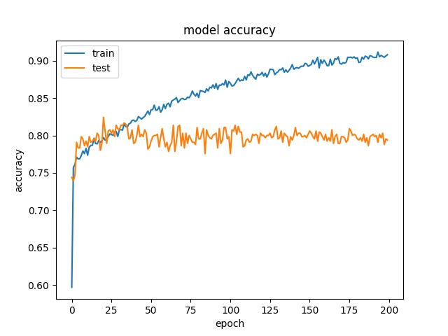
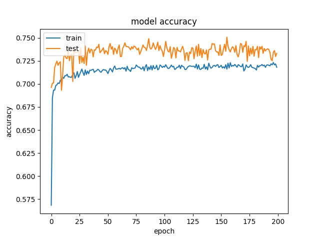
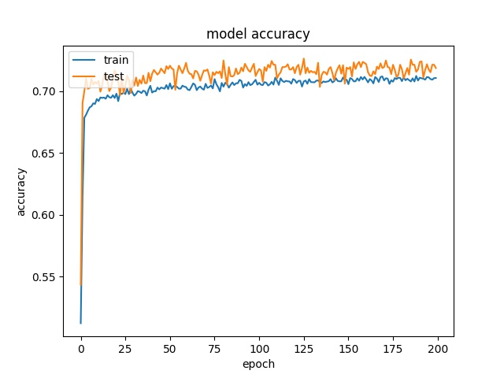
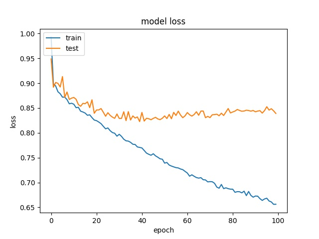
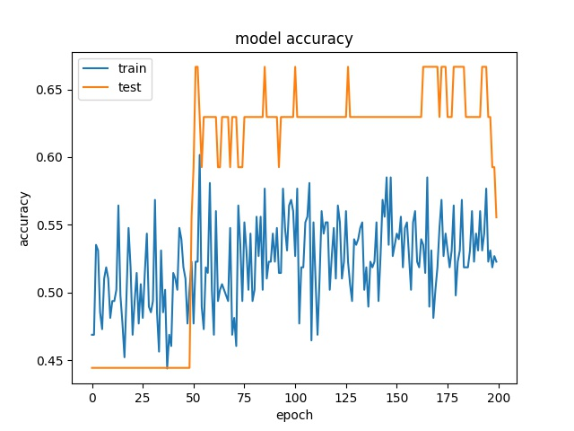
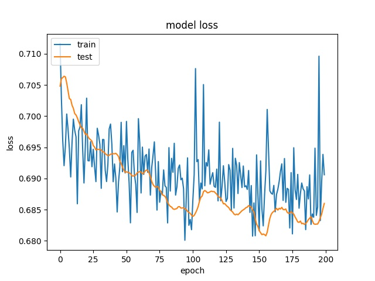

Reference
----------

--------------------------------------------------------  
Training results of None and Horz partition modes only
-------------------------------------------------------- 

More binary classes are tested

64

model1

.. image:: img/m1_qp120_64_acc_NH.jpg
    :width: 49%
.. image:: img/m1_qp120_64_loss_NH.jpg
    :width: 49%

model2

.. image:: img/mnist_qp120_64_acc_NH.jpg
    :width: 49%
.. image:: img/mnist_qp120_64_loss_NH.jpg
    :width: 49%

32

model1

.. image:: img/m1_qp120_32_acc_NH.jpg
    :width: 49%
.. image:: img/m1_qp120_32_loss_NH.jpg
    :width: 49%
  
model2

.. image:: img/mnist_qp120_32_acc_NH.jpg
    :width: 49%
.. image:: img/mnist_qp120_32_loss_NH.jpg
    :width: 49%
    
16

model1

.. image:: img/m1_qp120_16_acc_NH.jpg
    :width: 49%
.. image:: img/m1_qp120_16_loss_NH.jpg
    :width: 49%

model2

.. image:: img/mnist_qp120_16_acc_NH.jpg
    :width: 49%
.. image:: img/mnist_qp120_16_loss_NH.jpg
    :width: 49%

These two classes can not be seperated well.

----------------------------------------------------------------  
Training results of Horz and Split partition modes only
----------------------------------------------------------------  

64

model1

.. image:: img/m1_qp120_64_acc_HS.jpg
    :width: 49%

model2

.. image:: img/mnist_qp120_64_acc_HS.jpg
    :width: 49%
.. image:: img/mnist_qp120_64_loss_HS.jpg
    :width: 49%

32

model1

.. image:: img/m1_qp120_32_acc_HS.jpg
    :width: 49%
.. image:: img/m1_qp120_32_loss_HS.jpg
    :width: 49%
  
model2

.. image:: img/mnist_qp120_32_acc_HS.jpg
    :width: 49%
.. image:: img/mnist_qp120_32_loss_HS.jpg
    :width: 49%
    
16

model1

.. image:: img/m1_qp120_16_acc_HS.jpg
    :width: 49%
.. image:: img/m1_qp120_16_loss_HS.jpg
    :width: 49%

model2

.. image:: img/mnist_qp120_16_acc_HS.jpg
    :width: 49%
.. image:: img/mnist_qp120_16_loss_HS.jpg
    :width: 49%

Horz and Split mode can be seperated well.

--------------------------------------------------------------   
Training results of None, Horz and Split partition modes only
--------------------------------------------------------------

Three classes are tested

64

model1

.. image:: img/m1_qp120_64_acc_NHS.jpg
    :width: 49%
.. image:: img/m1_qp120_64_loss_NHS.jpg
    :width: 49%

model2

.. image:: img/mnist_qp120_64_acc_NHS.jpg
    :width: 49%
.. image:: img/mnist_qp120_64_loss_NHS.jpg
    :width: 49%

32

model1

.. image:: img/m1_qp120_32_acc_NHS.jpg
    :width: 49%
.. image:: img/m1_qp120_32_loss_NHS.jpg
    :width: 49%
  
model2

.. image:: img/mnist_qp120_32_acc_NHS.jpg
    :width: 49%
.. image:: img/mnist_qp120_32_loss_NHS.jpg
    :width: 49%
    
16

model1

.. image:: img/m1_qp120_16_acc_NHS.jpg
    :width: 49%
.. image:: img/m1_qp120_16_loss_NHS.jpg
    :width: 49%

model2

.. image:: img/mnist_qp120_16_acc_NHS.jpg
    :width: 49%
.. image:: img/mnist_qp120_16_loss_NHS.jpg
    :width: 49%

------------------------------------------------------------ 
Training results of Horz4 and Vert4 partition modes only
------------------------------------------------------------ 

64

model1

.. image:: img/m1_qp120_64_acc_HV4.jpg
    :width: 49%
.. image:: img/m1_qp120_64_loss_HV4.jpg
    :width: 49%

model2

.. image:: img/mnist_qp120_64_acc_HV4.jpg
    :width: 49%
.. image:: img/mnist_qp120_64_loss_HV4.jpg
    :width: 49%

32

model1

.. image:: img/m1_qp120_32_acc_HV4.jpg
    :width: 49%
.. image:: img/m1_qp120_32_loss_HV4.jpg
    :width: 49%
  
model2

.. image:: img/mnist_qp120_32_acc_HV4.jpg
    :width: 49%
.. image:: img/mnist_qp120_32_loss_HV4.jpg
    :width: 49%
    
16

model1

.. image:: img/m1_qp120_16_acc_HV4.jpg
    :width: 49%
.. image:: img/m1_qp120_16_loss_HV4.jpg
    :width: 49%

model2

.. image:: img/mnist_qp120_16_acc_HV4.jpg
    :width: 49%
.. image:: img/mnist_qp120_16_loss_HV4.jpg
    :width: 49%

--------------------------------------------------------  
Training results of Split and Horz4 partition modes only
-------------------------------------------------------- 

64

model1

.. image:: img/m1_qp120_64_acc_SH4.jpg
    :width: 49%
.. image:: img/m1_qp120_64_loss_SH4.jpg
    :width: 49%

model2

.. image:: img/mnist_qp120_64_acc_SH4.jpg
    :width: 49%
.. image:: img/mnist_qp120_64_loss_SH4.jpg
    :width: 49%

32

model1

.. image:: img/m1_qp120_32_loss_SH4.jpg
    :width: 49%
  
model2

.. image:: img/mnist_qp120_32_loss_SH4.jpg
    :width: 49%
    
16

model1

.. image:: img/m1_qp120_16_loss_SH4.jpg
    :width: 49%

model2

.. image:: img/mnist_qp120_16_acc_SH4.jpg
    :width: 49%
.. image:: img/mnist_qp120_16_loss_SH4.jpg
    :width: 49%

--------------------------------------------------------  
Training results of Split and Vert4 partition modes only
-------------------------------------------------------- 

64

model1

.. image:: img/m1_qp120_64_acc_SV4.jpg
    :width: 49%
.. image:: img/m1_qp120_64_loss_SV4.jpg
    :width: 49%

model2

.. image:: img/mnist_qp120_64_acc_SV4.jpg
    :width: 49%
.. image:: img/mnist_qp120_64_loss_SV4.jpg
    :width: 49%

32

model1

.. image:: img/m1_qp120_32_acc_SV4.jpg
    :width: 49%
.. image:: img/m1_qp120_32_loss_SV4.jpg
    :width: 49%
  
model2

.. image:: img/mnist_qp120_32_acc_SV4.jpg
    :width: 49%
.. image:: img/mnist_qp120_32_loss_SV4.jpg
    :width: 49%
    
16

model1

.. image:: img/m1_qp120_16_loss_SV4.jpg
    :width: 49%

model2

.. image:: img/mnist_qp120_16_acc_SV4.jpg
    :width: 49%
.. image:: img/mnist_qp120_16_loss_SV4.jpg
    :width: 49%

----------------------------------------------------------------  
Training results of Split, Horz4 and Vert4 partition modes only
----------------------------------------------------------------  

64

model1

.. image:: img/m1_qp120_64_acc_SHV4.jpg
    :width: 49%
.. image:: img/m1_qp120_64_loss_SHV4.jpg
    :width: 49%

model2

.. image:: img/mnist_qp120_64_acc_SHV4.jpg
    :width: 49%
.. image:: img/mnist_qp120_64_loss_SHV4.jpg
    :width: 49%

32

model1

.. image:: img/m1_qp120_32_acc_SHV4.jpg
    :width: 49%
.. image:: img/m1_qp120_32_loss_SHV4.jpg
    :width: 49%
  
model2

.. image:: img/mnist_qp120_32_acc_SHV4.jpg
    :width: 49%
.. image:: img/mnist_qp120_32_loss_SHV4.jpg
    :width: 49%
    
16

model1

.. image:: img/m1_qp120_16_acc_SHV4.jpg
    :width: 49%
.. image:: img/m1_qp120_16_loss_SHV4.jpg
    :width: 49%

model2

.. image:: img/mnist_qp120_16_acc_SHV4.jpg
    :width: 49%

----------------------------------------------------------------  
Training results of HorzA and HorzB partition modes only
----------------------------------------------------------------  

64

model1

model2

.. image:: img/mnist_qp120_64_acc_HAB.jpg
    :width: 49%
.. image:: img/mnist_qp120_64_loss_HAB.jpg
    :width: 49%

32

model1

.. image:: img/m1_qp120_32_acc_HAB.jpg
    :width: 49%
.. image:: img/m1_qp120_32_loss_HAB.jpg
    :width: 49%
  
model2

.. image:: img/mnist_qp120_32_acc_HAB.jpg
    :width: 49%
.. image:: img/mnist_qp120_32_loss_HAB.jpg
    :width: 49%
    
16

model1

.. image:: img/m1_qp120_16_acc_HAB.jpg
    :width: 49%
.. image:: img/m1_qp120_16_loss_HAB.jpg
    :width: 49%

model2

.. image:: img/mnist_qp120_16_acc_HAB.jpg
    :width: 49%
.. image:: img/mnist_qp120_16_loss_HAB.jpg
    :width: 49%

