==========
TEMP
==========

------------------------------------------------------------
Training results of None and Split partition modes only
------------------------------------------------------------

First, the None and Split classses are tested. The number of samples for both classes is equal.

Notice the output of the model is changed to only two classes, the loss function is also changed binary cross entropy.

64

each class has 2000 samples

model1

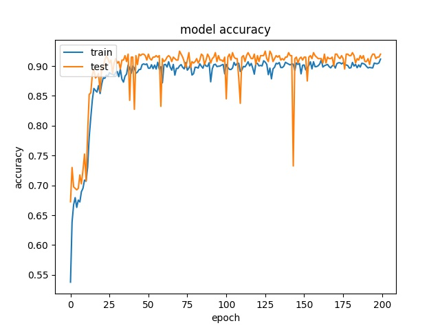
.. image:: img/m1_qp120_64_loss_NS.jpg
    :width: 49%

model2

.. image:: img/mnist_qp120_64_acc_NS.jpg
    :width: 49%
.. image:: img/mnist_qp120_64_loss_NS.jpg
    :width: 49%

32

each class has 25000 samples

model1

.. image:: img/m1_qp120_32_acc_NS.jpg
    :width: 49%
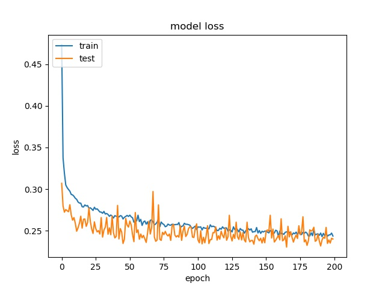

model2

.. image:: img/mnist_qp120_32_acc_NS.jpg
    :width: 49%
.. image:: img/mnist_qp120_32_loss_NS.jpg
    :width: 49%

Model 2 offers more parameters. After it learns all the required features, it starts to memorize certain features only belongs to this data set, which cause overfitting. on the other side, model 1 has just enough parameters to memorize the correct features.

16

each class has 17500 samples

model1

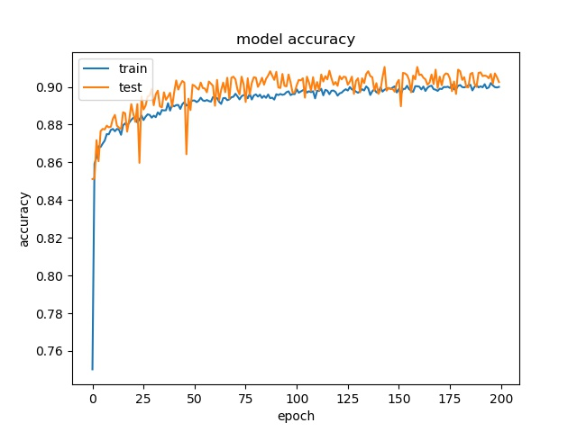
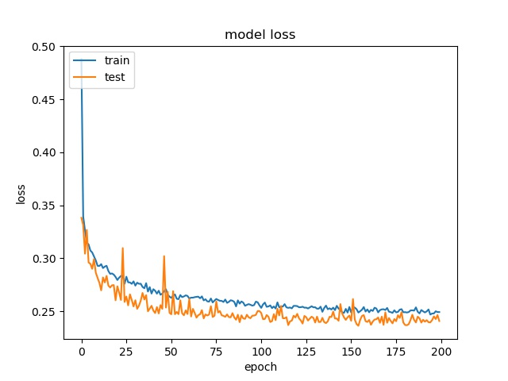

model2

.. image:: img/mnist_qp120_16_acc_NS.jpg
    :width: 49%
.. image:: img/mnist_qp120_16_loss_NS.jpg
    :width: 49%

The result shows that both models can distinguish these two classes easily. For all three block sizes, the accuray can reach around 90%. This means the model can successfully tell the difference between these two classes.

--------------------------------------------------------  
Training results of Horz and Vert partition modes only
-------------------------------------------------------- 

Next, the Horz and Vert classses are tested. The number of samples for both classes are also the same. 

64

each class has 499 samples

model1

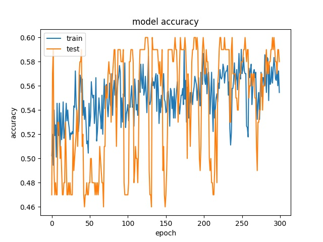
.. image:: img/m1_qp120_64_loss_HV.jpg
    :width: 49%

model2

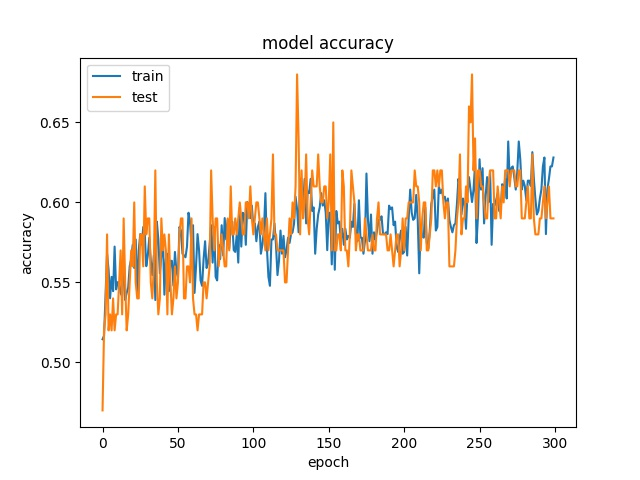
.. image:: img/mnist_qp120_64_loss_HV.jpg
    :width: 49%

32

each class has 5200 samples

model1

.. image:: img/m1_qp120_32_acc_HV.jpg
    :width: 49%
.. image:: img/m1_qp120_32_loss_HV.jpg
    :width: 49%
  
model2

.. image:: img/mnist_qp120_32_acc_HV.jpg
    :width: 49%
.. image:: img/mnist_qp120_32_loss_HV.jpg
    :width: 49%
    
16

each class has 32500 samples

model1

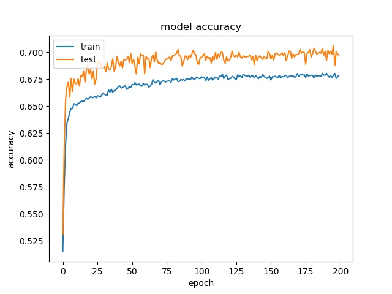
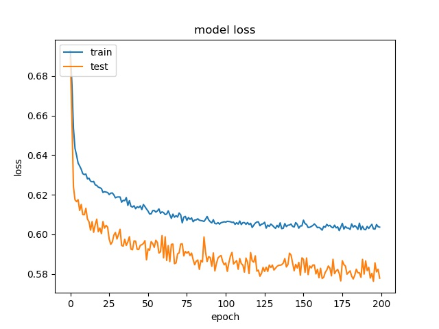

model2

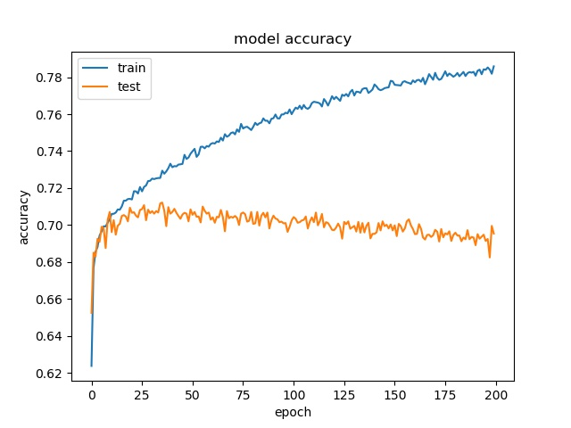
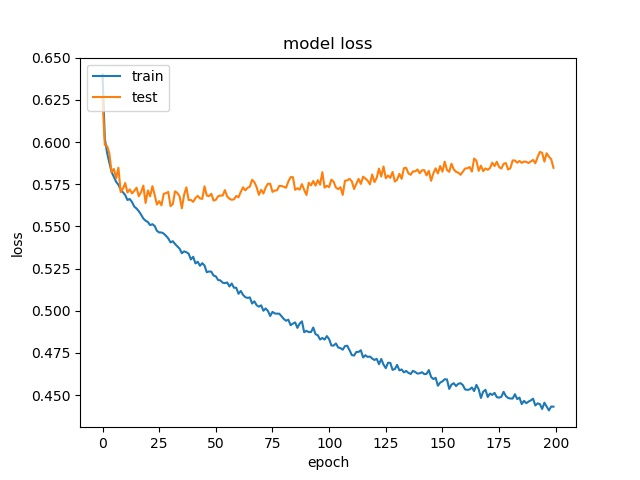

However, the accuracy is much lower. it can only reach between 55% to 70% for the Horz and Vert datasets.

Around 50% means may suggest the model only guess one class for evey sample.

From the tests above, it can be seen that the model can not really learn the features of some classes.

To clarify the root cause of this result, we train it with deeper and wider model to see if it is due to the model lack of sufficient parameters or it is because the horz and vert classes don't have clear features. 

Thus, the possible reason for low accuracy may due to the pattern encoded with these two partition modes are not unique so the model can not learn very well. Figure shows some patterns of blocks encoded in Vert and Horz partition modes. It seems some patterns are very similar but encoded with different modes. The reason may be that Horz and Vert rely more on the context in the frame (neighbor's data).

To clarify the real cause, a data set with more videos inluding 720p/1080p are used to train the model.

64

each class has 499 samples

model1

.. image:: img/m1_qp120_64_acc_HV_l.jpg
    :width: 49%
.. image:: img/m1_qp120_64_loss_HV_l.jpg
    :width: 49%

model2

.. image:: img/mnist_qp120_64_acc_HV_l.jpg
    :width: 49%
.. image:: img/mnist_qp120_64_loss_HV_l.jpg
    :width: 49%

32

each class has 5200 samples

model1

.. image:: img/m1_qp120_32_acc_HV_l.jpg
    :width: 49%
.. image:: img/m1_qp120_32_loss_HV_l.jpg
    :width: 49%
  
model2

.. image:: img/mnist_qp120_32_acc_HV_l.jpg
    :width: 49%
.. image:: img/mnist_qp120_32_loss_HV_l.jpg
    :width: 49%
    
16

each class has 32500 samples

model1

.. image:: img/m1_qp120_16_acc_HV_l.jpg
    :width: 49%
.. image:: img/m1_qp120_16_loss_HV_l.jpg
    :width: 49%

model2

.. image:: img/mnist_qp120_16_acc_HV_l.jpg
    :width: 49%
.. image:: img/mnist_qp120_16_loss_HV_l.jpg
    :width: 49%

To visualize the relation between data, dimentional reduction method was applied. 

.. image:: img/projector_NS.jpg

.. image:: img/projector_HV.jpg

It can be seen that data of NS can be seperated bette, but HV can't.

Other training results of different combinaion of classes can be found in reference. 

The full dataset can be found online (A jupyter notebook can be used to see the partition modes of the dataset)  

Since None and split is the most important classes, we merge the rest of the classes into one class. The reason is to avoid noises affecting each other. This strategy is to insure none and split can get the most correct prediction. The rest of classes are trained with a sub model to obtain higher accuracy

Binary None and the Rest
^^^^^^^^^^^^^^^^^^^^^^^^^^^

block size : 64x64

.. image:: img/m1_qp120_64_acc_NR.jpg
   :width: 49%
.. image:: img/m1_qp120_64_loss_NR.jpg
   :width: 49%

**(top) model 1, (bottom) model 2** 

----

block size : 32x32

.. image:: img/m1_qp120_32_acc_NR.jpg
   :width: 49%
.. image:: img/m1_qp120_32_loss_NR.jpg
   :width: 49%

**(top) model 1, (bottom) model 2** 

----

block size : 16x16

.. image:: img/m1_qp120_16_acc_NR.jpg
   :width: 49%
.. image:: img/m1_qp120_16_loss_NR.jpg
   :width: 49%
   
**(top) model 1, (bottom) model 2** 

9 classes (without None)
^^^^^^^^^^^^^^^^^^^^^^^^^^^

block size : 64x64

.. image:: img/m1_qp120_64_loss_S9c.jpg
   :width: 49%

----

block size : 32x32

.. image:: img/m1_qp120_32_acc_S9c.jpg
   :width: 49%
.. image:: img/m1_qp120_32_loss_S9c.jpg
   :width: 49%

----

block size : 16x16

.. image:: img/m1_qp120_16_acc_S9c.jpg
   :width: 49%
.. image:: img/m1_qp120_16_loss_S9c.jpg
   :width: 49%
   

split and rest 8 classes (binary)
^^^^^^^^^^^^^^^^^^^^^^^^^^^^^^^^^^^^

block size : 64x64

.. image:: img/m1_qp120_64_acc_SR8.jpg
   :width: 49%
.. image:: img/m1_qp120_64_loss_SR8.jpg
   :width: 49%

----

block size : 32x32

.. image:: img/m1_qp120_32_acc_SR8.jpg
   :width: 49%
.. image:: img/m1_qp120_32_loss_SR8.jpg
   :width: 49%

----

block size : 16x16

.. image:: img/m1_qp120_16_acc_SR8.jpg
   :width: 49%

   

9 classes (without SPLIT)
^^^^^^^^^^^^^^^^^^^^^^^^^^^^^^

block size : 64x64

.. image:: img/m1_qp120_64_acc_N9c.jpg
   :width: 49%
.. image:: img/m1_qp120_64_loss_N9c.jpg
   :width: 49%

----

block size : 32x32

.. image:: img/m1_qp120_32_acc_N9c.jpg
   :width: 49%
.. image:: img/m1_qp120_32_loss_N9c.jpg
   :width: 49%

----

block size : 16x16

.. image:: img/m1_qp120_16_acc_N9c.jpg
   :width: 49%
.. image:: img/m1_qp120_16_loss_N9c.jpg
   :width: 49%

--------------------------------------------------------  
Training results of None and Horz partition modes only
-------------------------------------------------------- 

More binary classes are tested

64

model1

.. image:: img/m1_qp120_64_acc_NH.jpg
    :width: 49%
.. image:: img/m1_qp120_64_loss_NH.jpg
    :width: 49%

model2

.. image:: img/mnist_qp120_64_acc_NH.jpg
    :width: 49%
.. image:: img/mnist_qp120_64_loss_NH.jpg
    :width: 49%

32

model1

.. image:: img/m1_qp120_32_acc_NH.jpg
    :width: 49%
.. image:: img/m1_qp120_32_loss_NH.jpg
    :width: 49%
  
model2

.. image:: img/mnist_qp120_32_acc_NH.jpg
    :width: 49%
.. image:: img/mnist_qp120_32_loss_NH.jpg
    :width: 49%
    
16

model1

.. image:: img/m1_qp120_16_acc_NH.jpg
    :width: 49%
.. image:: img/m1_qp120_16_loss_NH.jpg
    :width: 49%

model2

.. image:: img/mnist_qp120_16_acc_NH.jpg
    :width: 49%
.. image:: img/mnist_qp120_16_loss_NH.jpg
    :width: 49%

These two classes can not be seperated well.

----------------------------------------------------------------  
Training results of Horz and Split partition modes only
----------------------------------------------------------------  

64

model1

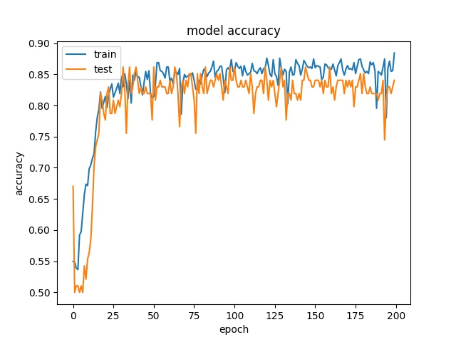
.. image:: img/m1_qp120_64_loss_HS.jpg
    :width: 49%

model2

.. image:: img/mnist_qp120_64_acc_HS.jpg
    :width: 49%
.. image:: img/mnist_qp120_64_loss_HS.jpg
    :width: 49%

32

model1

.. image:: img/m1_qp120_32_acc_HS.jpg
    :width: 49%
.. image:: img/m1_qp120_32_loss_HS.jpg
    :width: 49%
  
model2

.. image:: img/mnist_qp120_32_acc_HS.jpg
    :width: 49%
.. image:: img/mnist_qp120_32_loss_HS.jpg
    :width: 49%
    
16

model1

.. image:: img/m1_qp120_16_acc_HS.jpg
    :width: 49%
.. image:: img/m1_qp120_16_loss_HS.jpg
    :width: 49%

model2

.. image:: img/mnist_qp120_16_acc_HS.jpg
    :width: 49%
.. image:: img/mnist_qp120_16_loss_HS.jpg
    :width: 49%

Horz and Split mode can be seperated well.

--------------------------------------------------------------   
Training results of None, Horz and Split partition modes only
--------------------------------------------------------------

Three classes are tested

64

model1

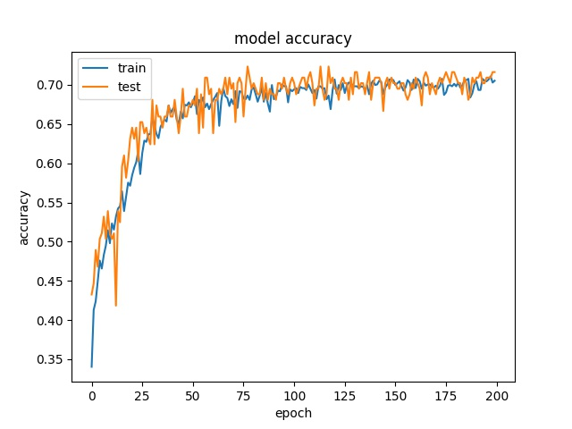
.. image:: img/m1_qp120_64_loss_NHS.jpg
    :width: 49%

model2

.. image:: img/mnist_qp120_64_acc_NHS.jpg
    :width: 49%
.. image:: img/mnist_qp120_64_loss_NHS.jpg
    :width: 49%

32

model1

.. image:: img/m1_qp120_32_acc_NHS.jpg
    :width: 49%
.. image:: img/m1_qp120_32_loss_NHS.jpg
    :width: 49%
  
model2

.. image:: img/mnist_qp120_32_acc_NHS.jpg
    :width: 49%
.. image:: img/mnist_qp120_32_loss_NHS.jpg
    :width: 49%
    
16

model1

.. image:: img/m1_qp120_16_acc_NHS.jpg
    :width: 49%
.. image:: img/m1_qp120_16_loss_NHS.jpg
    :width: 49%

model2

.. image:: img/mnist_qp120_16_acc_NHS.jpg
    :width: 49%
.. image:: img/mnist_qp120_16_loss_NHS.jpg
    :width: 49%

------------------------------------------------------------ 
Training results of Horz4 and Vert4 partition modes only
------------------------------------------------------------ 

64

model1

.. image:: img/m1_qp120_64_acc_HV4.jpg
    :width: 49%
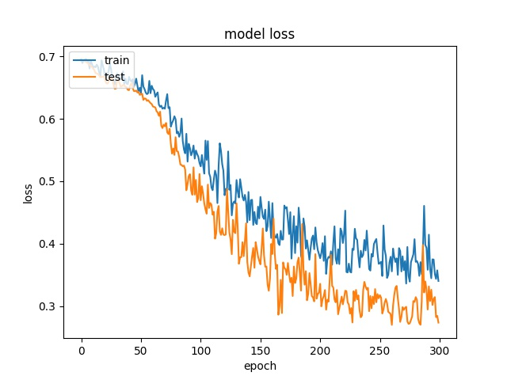

model2

.. image:: img/mnist_qp120_64_acc_HV4.jpg
    :width: 49%
.. image:: img/mnist_qp120_64_loss_HV4.jpg
    :width: 49%

32

model1

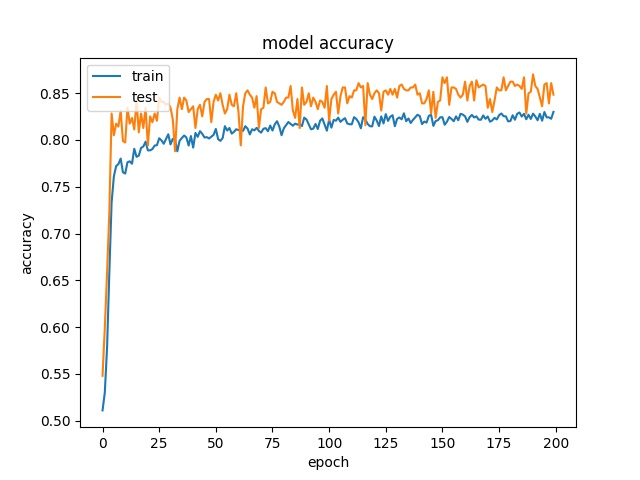
.. image:: img/m1_qp120_32_loss_HV4.jpg
    :width: 49%
  
model2

.. image:: img/mnist_qp120_32_acc_HV4.jpg
    :width: 49%
.. image:: img/mnist_qp120_32_loss_HV4.jpg
    :width: 49%
    
16

model1

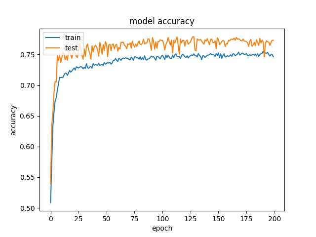
.. image:: img/m1_qp120_16_loss_HV4.jpg
    :width: 49%

model2

.. image:: img/mnist_qp120_16_acc_HV4.jpg
    :width: 49%
.. image:: img/mnist_qp120_16_loss_HV4.jpg
    :width: 49%

--------------------------------------------------------  
Training results of Split and Horz4 partition modes only
-------------------------------------------------------- 

64

model1

.. image:: img/m1_qp120_64_acc_SH4.jpg
    :width: 49%
.. image:: img/m1_qp120_64_loss_SH4.jpg
    :width: 49%

model2

.. image:: img/mnist_qp120_64_acc_SH4.jpg
    :width: 49%
.. image:: img/mnist_qp120_64_loss_SH4.jpg
    :width: 49%

32

model1

.. image:: img/m1_qp120_32_acc_SH4.jpg
    :width: 49%
.. image:: img/m1_qp120_32_loss_SH4.jpg
    :width: 49%
  
model2

.. image:: img/mnist_qp120_32_acc_SH4.jpg
    :width: 49%
.. image:: img/mnist_qp120_32_loss_SH4.jpg
    :width: 49%
    
16

model1

.. image:: img/m1_qp120_16_acc_SH4.jpg
    :width: 49%
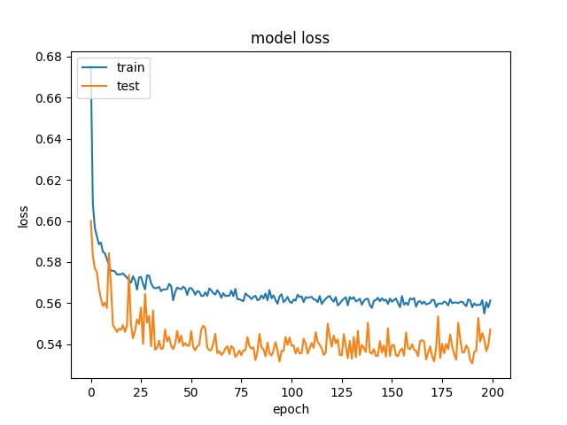

model2

.. image:: img/mnist_qp120_16_acc_SH4.jpg
    :width: 49%
.. image:: img/mnist_qp120_16_loss_SH4.jpg
    :width: 49%

--------------------------------------------------------  
Training results of Split and Vert4 partition modes only
-------------------------------------------------------- 

64

model1

.. image:: img/m1_qp120_64_acc_SV4.jpg
    :width: 49%
.. image:: img/m1_qp120_64_loss_SV4.jpg
    :width: 49%

model2

.. image:: img/mnist_qp120_64_acc_SV4.jpg
    :width: 49%
.. image:: img/mnist_qp120_64_loss_SV4.jpg
    :width: 49%

32

model1

.. image:: img/m1_qp120_32_acc_SV4.jpg
    :width: 49%
.. image:: img/m1_qp120_32_loss_SV4.jpg
    :width: 49%
  
model2

.. image:: img/mnist_qp120_32_acc_SV4.jpg
    :width: 49%
.. image:: img/mnist_qp120_32_loss_SV4.jpg
    :width: 49%
    
16

model1

.. image:: img/m1_qp120_16_acc_SV4.jpg
    :width: 49%
.. image:: img/m1_qp120_16_loss_SV4.jpg
    :width: 49%

model2

.. image:: img/mnist_qp120_16_acc_SV4.jpg
    :width: 49%
.. image:: img/mnist_qp120_16_loss_SV4.jpg
    :width: 49%

----------------------------------------------------------------  
Training results of Split, Horz4 and Vert4 partition modes only
----------------------------------------------------------------  

64

model1

.. image:: img/m1_qp120_64_acc_SHV4.jpg
    :width: 49%
.. image:: img/m1_qp120_64_loss_SHV4.jpg
    :width: 49%

model2

.. image:: img/mnist_qp120_64_acc_SHV4.jpg
    :width: 49%
.. image:: img/mnist_qp120_64_loss_SHV4.jpg
    :width: 49%

32

model1

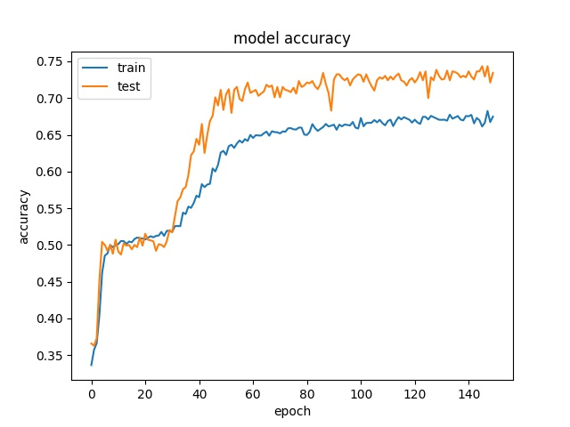
.. image:: img/m1_qp120_32_loss_SHV4.jpg
    :width: 49%
  
model2

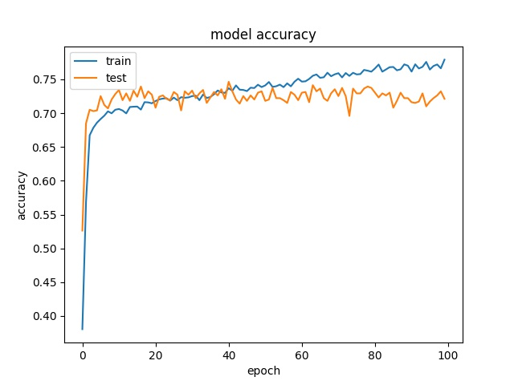
.. image:: img/mnist_qp120_32_loss_SHV4.jpg
    :width: 49%
    
16

model1

.. image:: img/m1_qp120_16_acc_SHV4.jpg
    :width: 49%
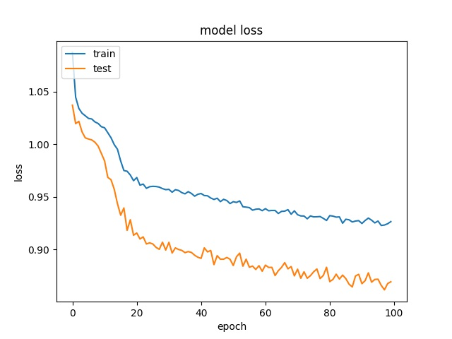

model2

.. image:: img/mnist_qp120_16_acc_SHV4.jpg
    :width: 49%
.. image:: img/mnist_qp120_16_loss_SHV4.jpg
    :width: 49%

----------------------------------------------------------------  
Training results of HorzA and HorzB partition modes only
----------------------------------------------------------------  

64

model1

.. image:: img/m1_qp120_64_acc_HAB.jpg
    :width: 49%
.. image:: img/m1_qp120_64_loss_HAB.jpg
    :width: 49%

model2

.. image:: img/mnist_qp120_64_acc_HAB.jpg
    :width: 49%
.. image:: img/mnist_qp120_64_loss_HAB.jpg
    :width: 49%

32

model1

.. image:: img/m1_qp120_32_acc_HAB.jpg
    :width: 49%
.. image:: img/m1_qp120_32_loss_HAB.jpg
    :width: 49%
  
model2

.. image:: img/mnist_qp120_32_acc_HAB.jpg
    :width: 49%
.. image:: img/mnist_qp120_32_loss_HAB.jpg
    :width: 49%
    
16

model1

.. image:: img/m1_qp120_16_acc_HAB.jpg
    :width: 49%
.. image:: img/m1_qp120_16_loss_HAB.jpg
    :width: 49%

model2

.. image:: img/mnist_qp120_16_acc_HAB.jpg
    :width: 49%
.. image:: img/mnist_qp120_16_loss_HAB.jpg
    :width: 49%

Test on Expanded Model
^^^^^^^^^^^^^^^^^^^^^^^

A deeper and wider model is used to test if it is possible to increase the accuracy by offering more parameters.

64

.. image:: img/mnist_xl_qp120_64_acc_HV.jpg
   :width: 49%
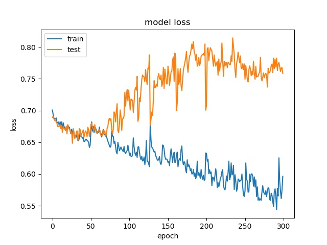

32

.. image:: img/mnist_xl_qp120_32_acc_HV.jpg
   :width: 49%
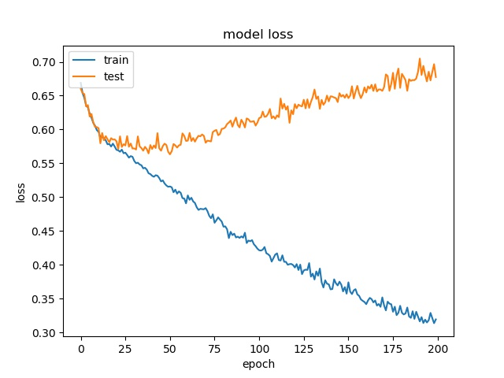

16

.. image:: img/mnist_xl_qp120_16_acc_HV.jpg
   :width: 49%
.. image:: img/mnist_xl_qp120_16_loss_HV.jpg
   :width: 49%

For 64x64, the accuracy is a little bit higher, but for 32x32, 16x16, it stays the same.

--------------------------------------------------------  
Training results of None, Split and the rest
-------------------------------------------------------- 

block size : 64x64

.. image:: img/m1_qp120_64_loss_NSR.jpg
   :width: 49%

**(top) model 1, (bottom) model 2** 

----

block size : 32x32

.. image:: img/mnist_qp120_32_loss_NSR.jpg
   :width: 49%

**(top) model 1, (bottom) model 2** 

----

block size : 16x16

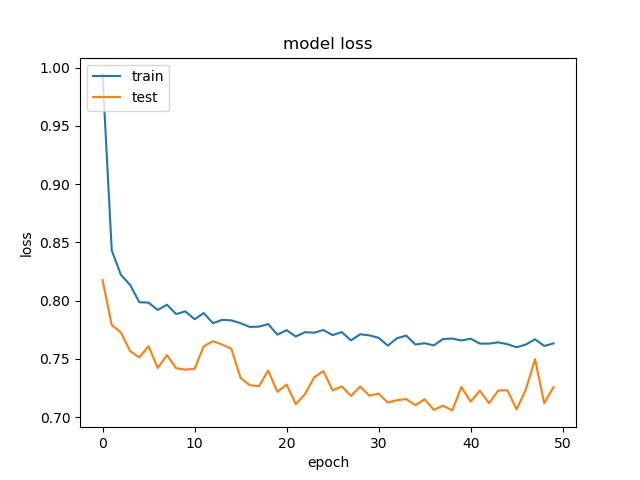

.. image:: img/mnist_qp120_16_acc_NSR.jpg
   :width: 49%

   
**(top) model 1, (bottom) model 2** 

It can be seen that, compared to the accuracy of trimmed data set, this can increase the prediction accuracy for noe and split  

To further prove this assumption, another data set with 9 720p frames is used to train the model.

The distribution of partition modes of different block sizes is shown below. 

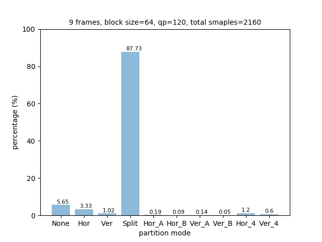
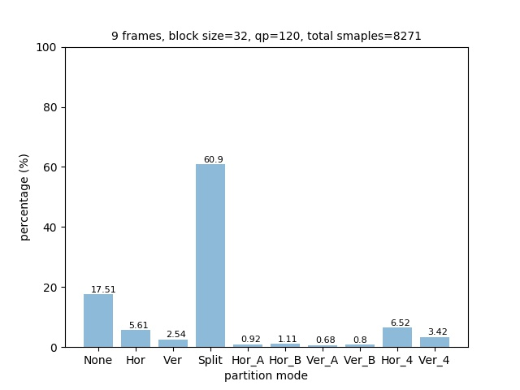

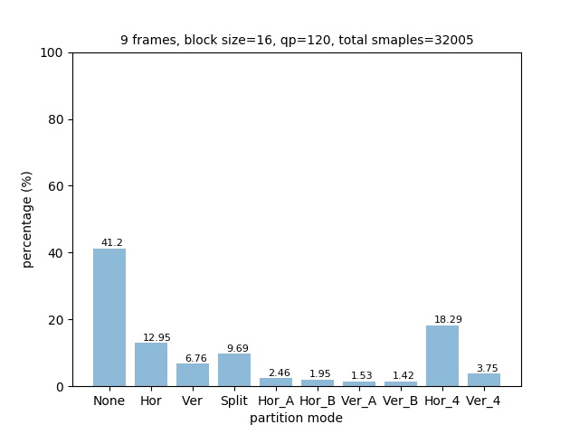

Notice the distribution of parititon modes is different from the 4K data set. It has higher ratio of Split partition mode for both block size 64x64 and 32x32, and less NONE partition modes for block size 16x16. This may be because the 720p frames have more concise scene than 4K frames.

Here we only test model 1 and the result is presented below:

block size : 64x64

.. image:: img/m1_qp120_64_acc_f_720.jpg
   :width: 49%
.. image:: img/m1_qp120_64_loss_f_720.jpg
   :width: 49%

block size : 32x32

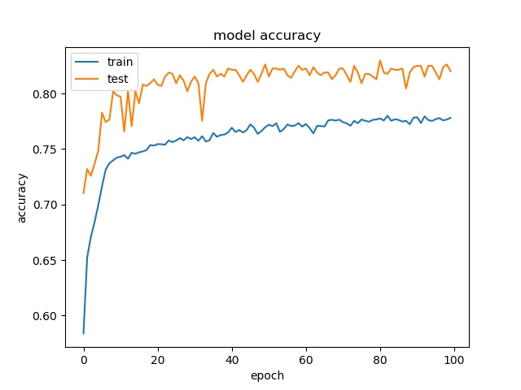
.. image:: img/m1_qp120_32_loss_f_720.jpg
   :width: 49%

block size : 16x16

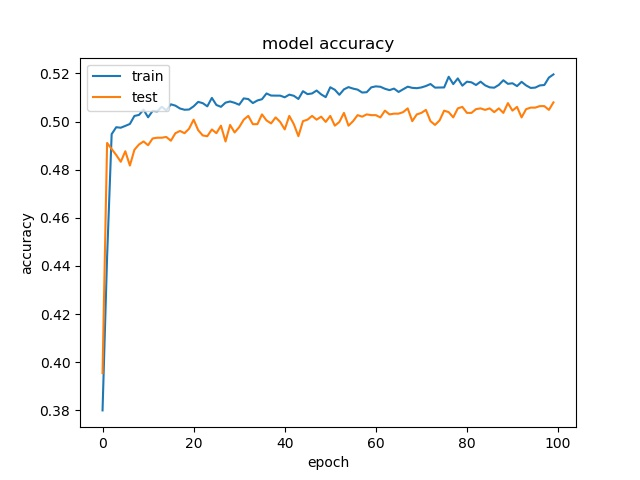
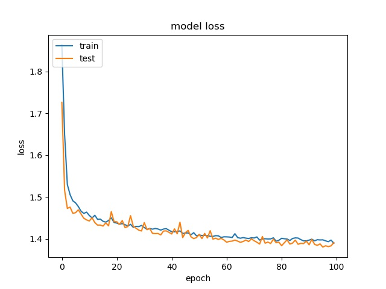

For block size 64x64, it can be seen that the accuracy increase to above 90%, which is close to percentage of none and split together. For32x32, the accuracy is also very close to the none and split together. For 16x16, the accuracy becomes lower. Notice that the partition modes are more distributed for 16x16 in this data set. 

Again, we use this model to predict the partition mode of a frame. The result shows it only predict the classes with top 3 number of sampels.

---------------------------------------------
Comparison between seperate qp and mixed qps
---------------------------------------------

From figure x, it can be seen that qp affect the partition decision tremendously. 

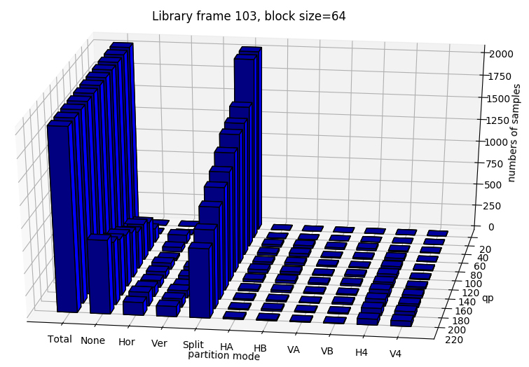
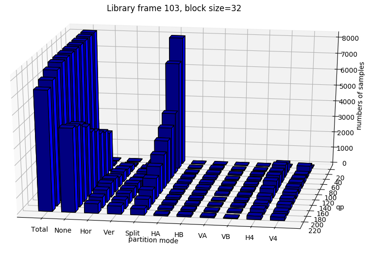

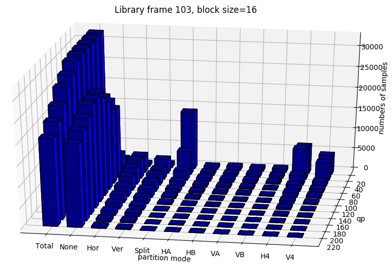

In this section, we test if the model can still learn the partition moedes for 3 classes with mixed qp.

The results show that the accuracy is quite low, in pratical usage, it is better to store  different parameters for different QP range.
