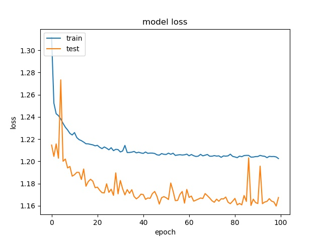

Binary None and the Rest
^^^^^^^^^^^^^^^^^^^^^^^^^^^

block size : 64x64

.. image:: img/m1_qp120_64_acc_f.jpg
   :width: 49%
.. image:: img/m1_qp120_64_loss_f.jpg
   :width: 49%

.. image:: img/mnist_qp120_64_acc_f.jpg
   :width: 49%
.. image:: img/mnist_qp120_64_loss_f.jpg
   :width: 49%

**(top) model 1, (bottom) model 2** 

----

block size : 32x32

.. image:: img/m1_qp120_32_acc_sh.jpg
   :width: 49%
.. image:: img/m1_qp120_32_loss_sh.jpg
   :width: 49%

.. image:: img/mnist_qp120_32_acc_sh.jpg
   :width: 49%
.. image:: img/mnist_qp120_32_loss_sh.jpg
   :width: 49%

**(top) model 1, (bottom) model 2** 

----

block size : 16x16

.. image:: img/m1_qp120_16_acc_f.jpg
   :width: 49%

.. image:: img/mnist_qp120_16_acc_f.jpg
   :width: 49%
.. image:: img/mnist_qp120_16_loss_f.jpg
   :width: 49%
   
**(top) model 1, (bottom) model 2** 

9 classes except None
^^^^^^^^^^^^^^^^^^^^^^^^^^^

block size : 64x64

.. image:: img/m1_qp120_64_acc_f.jpg
   :width: 49%
.. image:: img/m1_qp120_64_loss_f.jpg
   :width: 49%

----

block size : 32x32

.. image:: img/m1_qp120_32_acc_sh.jpg
   :width: 49%
.. image:: img/m1_qp120_32_loss_sh.jpg
   :width: 49%

----

block size : 16x16

.. image:: img/m1_qp120_16_acc_f.jpg
   :width: 49%

   

split and rest 8 classes (binary)
^^^^^^^^^^^^^^^^^^^^^^^^^^^^^^^^^^^^

block size : 64x64

.. image:: img/m1_qp120_64_acc_f.jpg
   :width: 49%
.. image:: img/m1_qp120_64_loss_f.jpg
   :width: 49%

----

block size : 32x32

.. image:: img/m1_qp120_32_acc_sh.jpg
   :width: 49%
.. image:: img/m1_qp120_32_loss_sh.jpg
   :width: 49%

----

block size : 16x16

.. image:: img/m1_qp120_16_acc_f.jpg
   :width: 49%

   

Binary Split and the Rest 9 classes
^^^^^^^^^^^^^^^^^^^^^^^^^^^^^^^^^^^^

block size : 64x64

.. image:: img/m1_qp120_64_acc_f.jpg
   :width: 49%
.. image:: img/m1_qp120_64_loss_f.jpg
   :width: 49%

----

block size : 32x32

.. image:: img/m1_qp120_32_acc_sh.jpg
   :width: 49%
.. image:: img/m1_qp120_32_loss_sh.jpg
   :width: 49%

----

block size : 16x16

.. image:: img/m1_qp120_16_acc_f.jpg
   :width: 49%

9 classes (no SPLIT)
^^^^^^^^^^^^^^^^^^^^^^^^^^^^^^

block size : 64x64

.. image:: img/m1_qp120_64_acc_f.jpg
   :width: 49%
.. image:: img/m1_qp120_64_loss_f.jpg
   :width: 49%

----

block size : 32x32

.. image:: img/m1_qp120_32_acc_sh.jpg
   :width: 49%
.. image:: img/m1_qp120_32_loss_sh.jpg
   :width: 49%

----

block size : 16x16

.. image:: img/m1_qp120_16_acc_f.jpg
   :width: 49%

None and the Rest 8 classes
^^^^^^^^^^^^^^^^^^^^^^^^^^^^^^
