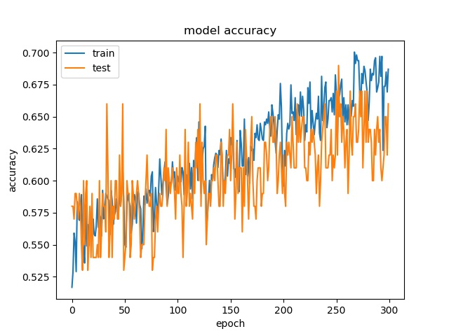

==========
TEMP
==========

Binary None and the Rest
^^^^^^^^^^^^^^^^^^^^^^^^^^^

block size : 64x64

.. image:: img/m1_qp120_64_acc_NR.jpg
   :width: 49%
.. image:: img/m1_qp120_64_loss_NR.jpg
   :width: 49%

**(top) model 1, (bottom) model 2** 

----

block size : 32x32

.. image:: img/m1_qp120_32_acc_NR.jpg
   :width: 49%

**(top) model 1, (bottom) model 2** 

----

block size : 16x16

.. image:: img/m1_qp120_16_acc_NR.jpg
   :width: 49%
.. image:: img/m1_qp120_16_loss_NR.jpg
   :width: 49%
   
**(top) model 1, (bottom) model 2** 

9 classes (without None)
^^^^^^^^^^^^^^^^^^^^^^^^^^^

block size : 64x64

.. image:: img/m1_qp120_64_acc_S9c.jpg
   :width: 49%

----

block size : 32x32

.. image:: img/m1_qp120_32_acc_S9c.jpg
   :width: 49%

----

block size : 16x16

.. image:: img/m1_qp120_16_acc_S9c.jpg
   :width: 49%
.. image:: img/m1_qp120_16_loss_S9c.jpg
   :width: 49%
   

split and rest 8 classes (binary)
^^^^^^^^^^^^^^^^^^^^^^^^^^^^^^^^^^^^

block size : 64x64

.. image:: img/m1_qp120_64_acc_SR8.jpg
   :width: 49%
.. image:: img/m1_qp120_64_loss_SR8.jpg
   :width: 49%

----

block size : 32x32

.. image:: img/m1_qp120_32_loss_SR8.jpg
   :width: 49%

----

block size : 16x16

.. image:: img/m1_qp120_16_loss_SR8.jpg
   :width: 49%
   

Binary Split and the Rest 9 classes
^^^^^^^^^^^^^^^^^^^^^^^^^^^^^^^^^^^^

block size : 64x64

.. image:: img/m1_qp120_64_acc_SR.jpg
   :width: 49%
.. image:: img/m1_qp120_64_loss_SR.jpg
   :width: 49%

----

block size : 32x32

.. image:: img/m1_qp120_32_acc_SR.jpg
   :width: 49%
.. image:: img/m1_qp120_32_loss_SR.jpg
   :width: 49%

----

block size : 16x16

.. image:: img/m1_qp120_16_acc_SR.jpg
   :width: 49%
.. image:: img/m1_qp120_16_loss_SR.jpg
   :width: 49%

9 classes (without SPLIT)
^^^^^^^^^^^^^^^^^^^^^^^^^^^^^^

block size : 64x64

.. image:: img/m1_qp120_64_acc_N9c.jpg
   :width: 49%
.. image:: img/m1_qp120_64_loss_N9c.jpg
   :width: 49%

----

block size : 32x32

.. image:: img/m1_qp120_32_loss_N9c.jpg
   :width: 49%

----

block size : 16x16

.. image:: img/m1_qp120_16_loss_N9c.jpg
   :width: 49%

None and the Rest 8 classes (binary)
^^^^^^^^^^^^^^^^^^^^^^^^^^^^^^^^^^^^^

block size : 64x64

.. image:: img/m1_qp120_64_acc_NR8.jpg
   :width: 49%
.. image:: img/m1_qp120_64_loss_NR8.jpg
   :width: 49%

----

block size : 32x32

.. image:: img/m1_qp120_32_acc_NR8.jpg
   :width: 49%
.. image:: img/m1_qp120_32_loss_NR8.jpg
   :width: 49%

----

block size : 16x16

.. image:: img/m1_qp120_16_acc_NR8.jpg
   :width: 49%
.. image:: img/m1_qp120_16_loss_NR8.jpg
   :width: 49%

Test on Expanded Model
^^^^^^^^^^^^^^^^^^^^^^^

A deeper and wider model is used to test if it is possible to increase the accuracy by offering more parameters.

64

.. image:: img/mnist_xl_qp120_64_loss_HV.jpg
   :width: 49%

32

.. image:: img/mnist_xl_qp120_32_acc_HV.jpg
   :width: 49%
.. image:: img/mnist_xl_qp120_32_loss_HV.jpg
   :width: 49%

16

.. image:: img/mnist_xl_qp120_16_acc_HV.jpg
   :width: 49%
.. image:: img/mnist_xl_qp120_16_loss_HV.jpg
   :width: 49%

For 64x64, the accuracy is a little bit higher, but for 32x32, 16x16, it stays the same.
