==========
TEMP
==========

Binary None and the Rest
^^^^^^^^^^^^^^^^^^^^^^^^^^^

block size : 64x64

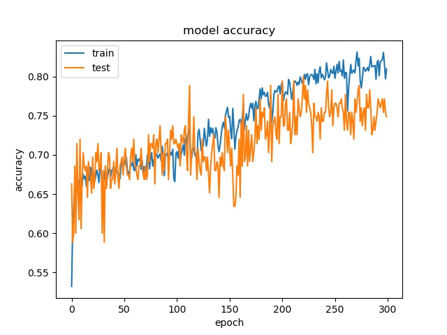
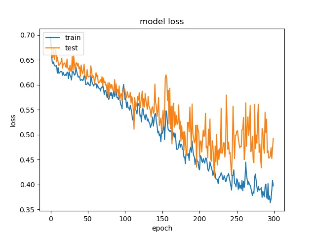

**(top) model 1, (bottom) model 2** 

----

block size : 32x32

.. image:: img/m1_qp120_32_loss_NR.jpg
   :width: 49%

**(top) model 1, (bottom) model 2** 

----

block size : 16x16

.. image:: img/m1_qp120_16_acc_NR.jpg
   :width: 49%

   
**(top) model 1, (bottom) model 2** 

9 classes (without None)
^^^^^^^^^^^^^^^^^^^^^^^^^^^

block size : 64x64

.. image:: img/m1_qp120_64_acc_S9c.jpg
   :width: 49%
.. image:: img/m1_qp120_64_loss_S9c.jpg
   :width: 49%

----

block size : 32x32

.. image:: img/m1_qp120_32_loss_S9c.jpg
   :width: 49%

----

block size : 16x16

   

split and rest 8 classes (binary)
^^^^^^^^^^^^^^^^^^^^^^^^^^^^^^^^^^^^

block size : 64x64

.. image:: img/m1_qp120_64_acc_SR8.jpg
   :width: 49%
.. image:: img/m1_qp120_64_loss_SR8.jpg
   :width: 49%

----

block size : 32x32

.. image:: img/m1_qp120_32_acc_SR8.jpg
   :width: 49%

----

block size : 16x16

.. image:: img/m1_qp120_16_acc_SR8.jpg
   :width: 49%
.. image:: img/m1_qp120_16_loss_SR8.jpg
   :width: 49%
   

9 classes (without SPLIT)
^^^^^^^^^^^^^^^^^^^^^^^^^^^^^^

block size : 64x64

.. image:: img/m1_qp120_64_acc_N9c.jpg
   :width: 49%
.. image:: img/m1_qp120_64_loss_N9c.jpg
   :width: 49%

----

block size : 32x32

.. image:: img/m1_qp120_32_acc_N9c.jpg
   :width: 49%

----

block size : 16x16

.. image:: img/m1_qp120_16_acc_N9c.jpg
   :width: 49%

--------------------------------------------------------  
Training results of None and Horz partition modes only
-------------------------------------------------------- 

More binary classes are tested

64

model1

.. image:: img/m1_qp120_64_acc_NH.jpg
    :width: 49%
.. image:: img/m1_qp120_64_loss_NH.jpg
    :width: 49%

model2

.. image:: img/mnist_qp120_64_acc_NH.jpg
    :width: 49%
.. image:: img/mnist_qp120_64_loss_NH.jpg
    :width: 49%

32

model1

.. image:: img/m1_qp120_32_acc_NH.jpg
    :width: 49%
.. image:: img/m1_qp120_32_loss_NH.jpg
    :width: 49%
  
model2

.. image:: img/mnist_qp120_32_acc_NH.jpg
    :width: 49%
.. image:: img/mnist_qp120_32_loss_NH.jpg
    :width: 49%
    
16

model1

.. image:: img/m1_qp120_16_acc_NH.jpg
    :width: 49%
.. image:: img/m1_qp120_16_loss_NH.jpg
    :width: 49%

model2

.. image:: img/mnist_qp120_16_acc_NH.jpg
    :width: 49%
.. image:: img/mnist_qp120_16_loss_NH.jpg
    :width: 49%

These two classes can not be seperated well.

----------------------------------------------------------------  
Training results of Horz and Split partition modes only
----------------------------------------------------------------  

64

model1

.. image:: img/m1_qp120_64_acc_HS.jpg
    :width: 49%
.. image:: img/m1_qp120_64_loss_HS.jpg
    :width: 49%

model2

.. image:: img/mnist_qp120_64_acc_HS.jpg
    :width: 49%
.. image:: img/mnist_qp120_64_loss_HS.jpg
    :width: 49%

32

model1

.. image:: img/m1_qp120_32_acc_HS.jpg
    :width: 49%
.. image:: img/m1_qp120_32_loss_HS.jpg
    :width: 49%
  
model2

.. image:: img/mnist_qp120_32_acc_HS.jpg
    :width: 49%
.. image:: img/mnist_qp120_32_loss_HS.jpg
    :width: 49%
    
16

model1

.. image:: img/m1_qp120_16_acc_HS.jpg
    :width: 49%
.. image:: img/m1_qp120_16_loss_HS.jpg
    :width: 49%

model2

.. image:: img/mnist_qp120_16_acc_HS.jpg
    :width: 49%
.. image:: img/mnist_qp120_16_loss_HS.jpg
    :width: 49%

Horz and Split mode can be seperated well.

--------------------------------------------------------------   
Training results of None, Horz and Split partition modes only
--------------------------------------------------------------

Three classes are tested

64

model1

.. image:: img/m1_qp120_64_acc_NHS.jpg
    :width: 49%
.. image:: img/m1_qp120_64_loss_NHS.jpg
    :width: 49%

model2

.. image:: img/mnist_qp120_64_acc_NHS.jpg
    :width: 49%
.. image:: img/mnist_qp120_64_loss_NHS.jpg
    :width: 49%

32

model1

.. image:: img/m1_qp120_32_acc_NHS.jpg
    :width: 49%
.. image:: img/m1_qp120_32_loss_NHS.jpg
    :width: 49%
  
model2

.. image:: img/mnist_qp120_32_acc_NHS.jpg
    :width: 49%
.. image:: img/mnist_qp120_32_loss_NHS.jpg
    :width: 49%
    
16

model1

.. image:: img/m1_qp120_16_acc_NHS.jpg
    :width: 49%
.. image:: img/m1_qp120_16_loss_NHS.jpg
    :width: 49%

model2

.. image:: img/mnist_qp120_16_acc_NHS.jpg
    :width: 49%
.. image:: img/mnist_qp120_16_loss_NHS.jpg
    :width: 49%

------------------------------------------------------------ 
Training results of Horz4 and Vert4 partition modes only
------------------------------------------------------------ 

64

model1

.. image:: img/m1_qp120_64_acc_HV4.jpg
    :width: 49%
.. image:: img/m1_qp120_64_loss_HV4.jpg
    :width: 49%

model2

.. image:: img/mnist_qp120_64_acc_HV4.jpg
    :width: 49%
.. image:: img/mnist_qp120_64_loss_HV4.jpg
    :width: 49%

32

model1

.. image:: img/m1_qp120_32_acc_HV4.jpg
    :width: 49%
.. image:: img/m1_qp120_32_loss_HV4.jpg
    :width: 49%
  
model2

.. image:: img/mnist_qp120_32_acc_HV4.jpg
    :width: 49%
.. image:: img/mnist_qp120_32_loss_HV4.jpg
    :width: 49%
    
16

model1

.. image:: img/m1_qp120_16_acc_HV4.jpg
    :width: 49%
.. image:: img/m1_qp120_16_loss_HV4.jpg
    :width: 49%

model2

.. image:: img/mnist_qp120_16_acc_HV4.jpg
    :width: 49%
.. image:: img/mnist_qp120_16_loss_HV4.jpg
    :width: 49%

--------------------------------------------------------  
Training results of Split and Horz4 partition modes only
-------------------------------------------------------- 

64

model1

.. image:: img/m1_qp120_64_acc_SH4.jpg
    :width: 49%
.. image:: img/m1_qp120_64_loss_SH4.jpg
    :width: 49%

model2

.. image:: img/mnist_qp120_64_acc_SH4.jpg
    :width: 49%
.. image:: img/mnist_qp120_64_loss_SH4.jpg
    :width: 49%

32

model1

.. image:: img/m1_qp120_32_acc_SH4.jpg
    :width: 49%
.. image:: img/m1_qp120_32_loss_SH4.jpg
    :width: 49%
  
model2

.. image:: img/mnist_qp120_32_acc_SH4.jpg
    :width: 49%
.. image:: img/mnist_qp120_32_loss_SH4.jpg
    :width: 49%
    
16

model1

.. image:: img/m1_qp120_16_acc_SH4.jpg
    :width: 49%
.. image:: img/m1_qp120_16_loss_SH4.jpg
    :width: 49%

model2

.. image:: img/mnist_qp120_16_acc_SH4.jpg
    :width: 49%
.. image:: img/mnist_qp120_16_loss_SH4.jpg
    :width: 49%

--------------------------------------------------------  
Training results of Split and Vert4 partition modes only
-------------------------------------------------------- 

64

model1

.. image:: img/m1_qp120_64_acc_SV4.jpg
    :width: 49%
.. image:: img/m1_qp120_64_loss_SV4.jpg
    :width: 49%

model2

.. image:: img/mnist_qp120_64_acc_SV4.jpg
    :width: 49%
.. image:: img/mnist_qp120_64_loss_SV4.jpg
    :width: 49%

32

model1

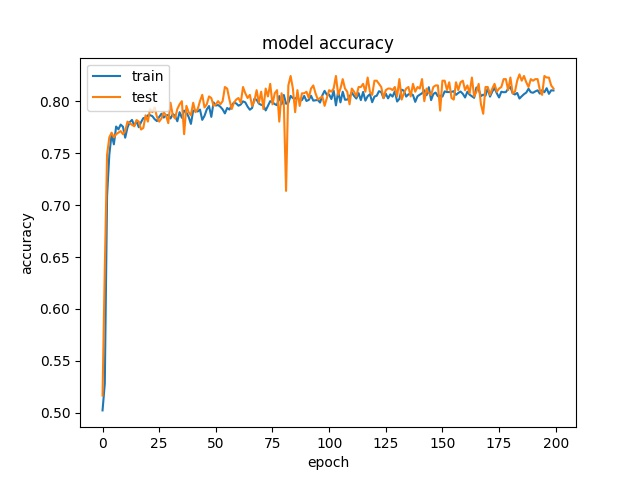
.. image:: img/m1_qp120_32_loss_SV4.jpg
    :width: 49%
  
model2

.. image:: img/mnist_qp120_32_acc_SV4.jpg
    :width: 49%
.. image:: img/mnist_qp120_32_loss_SV4.jpg
    :width: 49%
    
16

model1

.. image:: img/m1_qp120_16_acc_SV4.jpg
    :width: 49%
.. image:: img/m1_qp120_16_loss_SV4.jpg
    :width: 49%

model2

.. image:: img/mnist_qp120_16_acc_SV4.jpg
    :width: 49%
.. image:: img/mnist_qp120_16_loss_SV4.jpg
    :width: 49%

----------------------------------------------------------------  
Training results of Split, Horz4 and Vert4 partition modes only
----------------------------------------------------------------  

64

model1

.. image:: img/m1_qp120_64_acc_SHV4.jpg
    :width: 49%
.. image:: img/m1_qp120_64_loss_SHV4.jpg
    :width: 49%

model2

.. image:: img/mnist_qp120_64_acc_SHV4.jpg
    :width: 49%
.. image:: img/mnist_qp120_64_loss_SHV4.jpg
    :width: 49%

32

model1

.. image:: img/m1_qp120_32_acc_SHV4.jpg
    :width: 49%
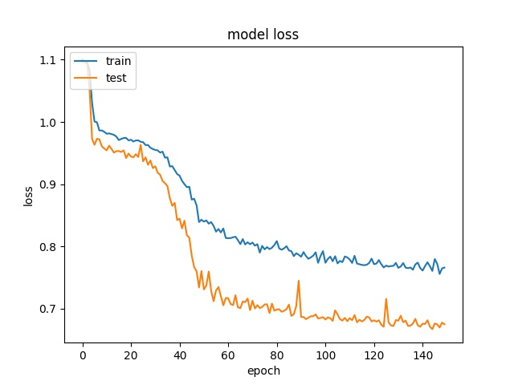
  
model2

.. image:: img/mnist_qp120_32_acc_SHV4.jpg
    :width: 49%
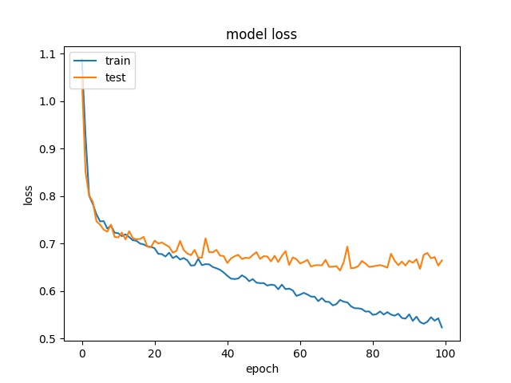
    
16

model1

.. image:: img/m1_qp120_16_acc_SHV4.jpg
    :width: 49%
.. image:: img/m1_qp120_16_loss_SHV4.jpg
    :width: 49%

model2

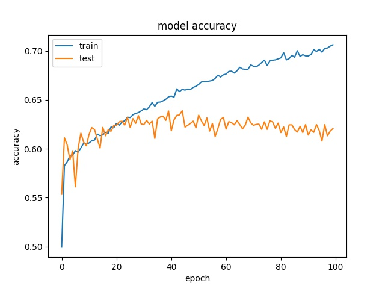
.. image:: img/mnist_qp120_16_loss_SHV4.jpg
    :width: 49%

----------------------------------------------------------------  
Training results of HorzA and HorzB partition modes only
----------------------------------------------------------------  

64

model1

.. image:: img/m1_qp120_64_acc_HAB.jpg
    :width: 49%
.. image:: img/m1_qp120_64_loss_HAB.jpg
    :width: 49%

model2

.. image:: img/mnist_qp120_64_acc_HAB.jpg
    :width: 49%
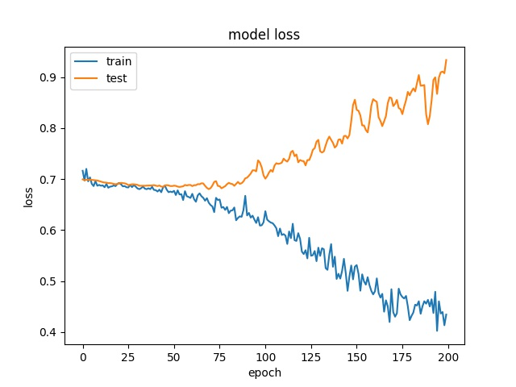

32

model1

.. image:: img/m1_qp120_32_acc_HAB.jpg
    :width: 49%
.. image:: img/m1_qp120_32_loss_HAB.jpg
    :width: 49%
  
model2

.. image:: img/mnist_qp120_32_acc_HAB.jpg
    :width: 49%
.. image:: img/mnist_qp120_32_loss_HAB.jpg
    :width: 49%
    
16

model1

.. image:: img/m1_qp120_16_acc_HAB.jpg
    :width: 49%
.. image:: img/m1_qp120_16_loss_HAB.jpg
    :width: 49%

model2

.. image:: img/mnist_qp120_16_acc_HAB.jpg
    :width: 49%
.. image:: img/mnist_qp120_16_loss_HAB.jpg
    :width: 49%

Test on Expanded Model
^^^^^^^^^^^^^^^^^^^^^^^

A deeper and wider model is used to test if it is possible to increase the accuracy by offering more parameters.

64

.. image:: img/mnist_xl_qp120_64_acc_HV.jpg
   :width: 49%
.. image:: img/mnist_xl_qp120_64_loss_HV.jpg
   :width: 49%

32

.. image:: img/mnist_xl_qp120_32_acc_HV.jpg
   :width: 49%
.. image:: img/mnist_xl_qp120_32_loss_HV.jpg
   :width: 49%

16

.. image:: img/mnist_xl_qp120_16_acc_HV.jpg
   :width: 49%
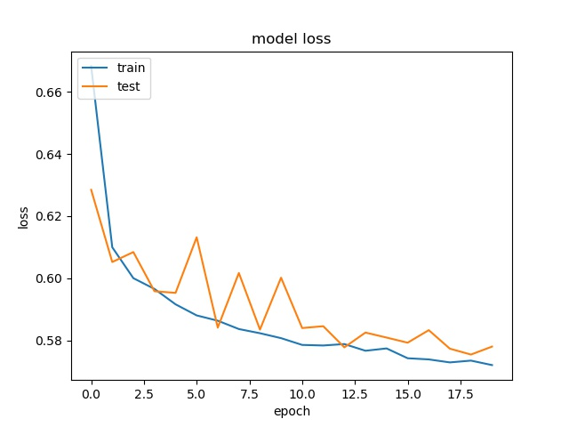

For 64x64, the accuracy is a little bit higher, but for 32x32, 16x16, it stays the same.

--------------------------------------------------------  
Training results of None, Split and the rest
-------------------------------------------------------- 

block size : 64x64

.. image:: img/m1_qp120_64_acc_NSR.jpg
   :width: 49%
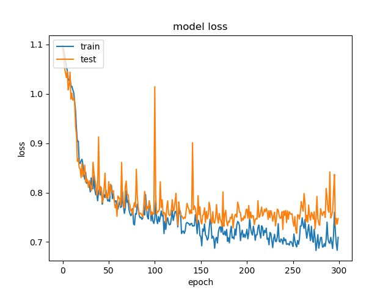

.. image:: img/mnist_qp120_64_acc_NSR.jpg
   :width: 49%
.. image:: img/mnist_qp120_64_loss_NSR.jpg
   :width: 49%

**(top) model 1, (bottom) model 2** 

----

block size : 32x32

.. image:: img/m1_qp120_32_acc_NSR.jpg
   :width: 49%
.. image:: img/m1_qp120_32_loss_NSR.jpg
   :width: 49%

.. image:: img/mnist_qp120_32_acc_NSR.jpg
   :width: 49%

**(top) model 1, (bottom) model 2** 

----

block size : 16x16

.. image:: img/m1_qp120_16_acc_NSR.jpg
   :width: 49%
.. image:: img/m1_qp120_16_loss_NSR.jpg
   :width: 49%

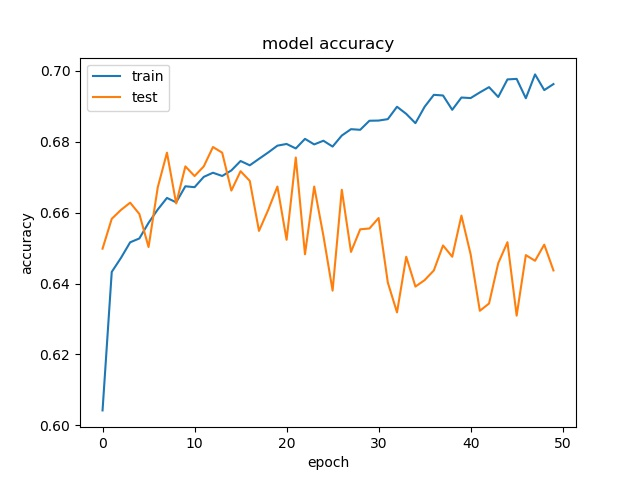
.. image:: img/mnist_qp120_16_loss_NSR.jpg
   :width: 49%
   
**(top) model 1, (bottom) model 2** 

It can be seen that, compared to the accuracy of trimmed data set, this can increase the prediction accuracy for noe and split  

To further prove this assumption, another data set with 9 720p frames is used to train the model.

The distribution of partition modes of different block sizes is shown below. 

.. image:: img/720_9f_qp120_distribution_64.jpg
   :width: 49%  
.. image:: img/720_9f_qp120_distribution_32.jpg
   :width: 49%

.. image:: img/720_9f_qp120_distribution_16.jpg
   :width: 50%

Notice the distribution of parititon modes is different from the 4K data set. It has higher ratio of Split partition mode for both block size 64x64 and 32x32, and less NONE partition modes for block size 16x16. This may be because the 720p frames have more concise scene than 4K frames.

Here we only test model 1 and the result is presented below:

block size : 64x64

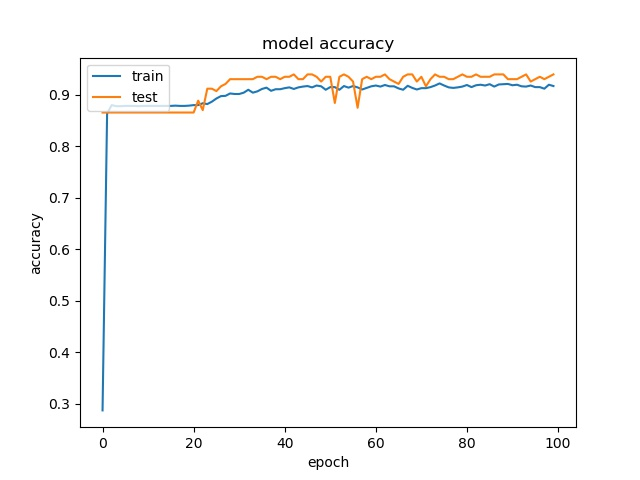
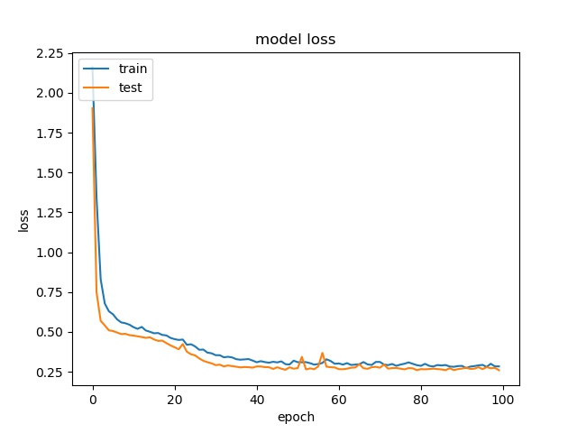

block size : 32x32

.. image:: img/m1_qp120_32_acc_f_720.jpg
   :width: 49%
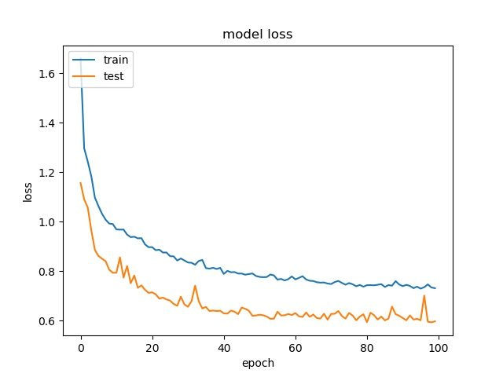

block size : 16x16

.. image:: img/m1_qp120_16_acc_f_720.jpg
   :width: 49%
.. image:: img/m1_qp120_16_loss_f_720.jpg
   :width: 49%

For block size 64x64, it can be seen that the accuracy increase to above 90%, which is close to percentage of none and split together. For32x32, the accuracy is also very close to the none and split together. For 16x16, the accuracy becomes lower. Notice that the partition modes are more distributed for 16x16 in this data set. 

Again, we use this model to predict the partition mode of a frame. The result shows it only predict the classes with top 3 number of sampels.

---------------------------------------------
Comparison between seperate qp and mixed qps
---------------------------------------------

From figure x, it can be seen that qp affect the partition decision tremendously. 

.. image:: img/library64.jpg
    :width: 49%
.. image:: img/library32.jpg
    :width: 49%

.. image:: img/library16.jpg
    :width: 49%

In this section, we test if the model can still learn the partition moedes for 3 classes with mixed qp.

The results show that the accuracy is quite low, in pratical usage, it is better to store  different parameters for different QP range.
