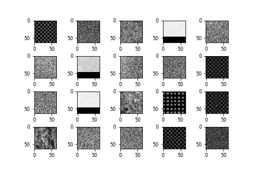
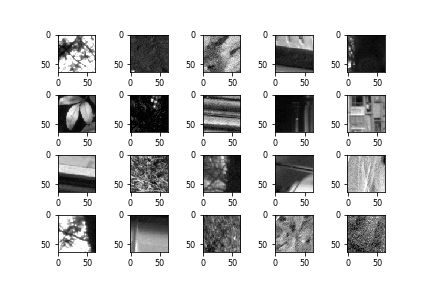
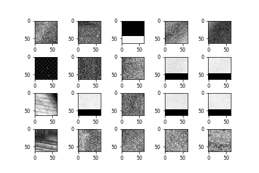
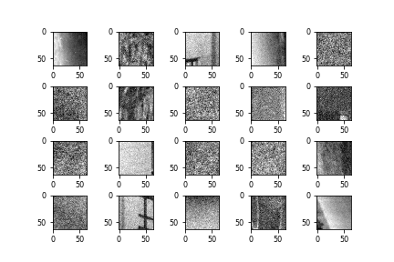
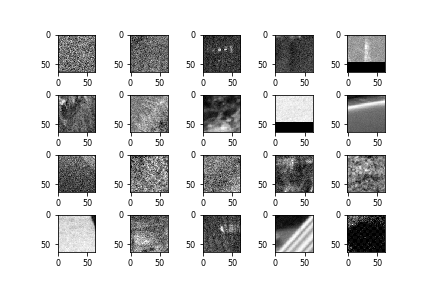
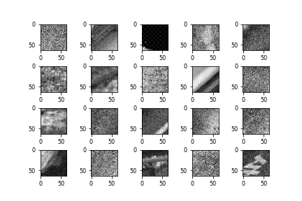

Training CNN Model
======================================

========================================
Labels Extraction from the Encoder
========================================

-----------------------
Video Source
-----------------------

Videos with different resolution are downloaded from the following websites:

http://medialab.sjtu.edu.cn/web4k/index.html

https://media.xiph.org/video/derf/

The list of video can be seen in the appendix. 

---------------
Encoding Mode
---------------

AV1 offers 4 different rate control modes, including Variable Bit Rate (VBR), Constant Bit Rate (CBR), Constrained Quality (CQ) and Constant Quality (Q) mode. Under VBR modes, the bit rate for each frame will be variate according to the frame contents. Under CBR mode, each frame will be encoded with the same bit rate. For these two modes, the quantization parameters (QP) will be selected based on the input bit rate. For CQ mode, QP is set in the required range. For Q mode, a fixed QP is used to encode the whole video. Q mode is used to collect training data in this research, which allows us to encode videos with specified QP.
The example encoding command is shown as follows::

  ./aomenc -o video.ivf --end-usage=q --cq-level=20 --limit=1  -w 3840 -h 2160 video.yuv

Since a scene in a video is normally highly similar, only one frame in a scene is encoded to avoid biased dataset. 

-----------------------
Code change in Encoder
-----------------------

For each frame, when it goes to the function ''rd_pcik_partition'', the partition decisions of each 64x64, 32x32 and 16x16 blocks are recorded and stored in a txt file.  Partition decisions are used as labels and indexed from 0 to 9 for each block as shown in Table. The qp of the frame is also stored.

The source code can be found here.

-----------------------
Data Processing
-----------------------

The txt file is further processed with Excel to remove the repeated decisions and store partition decisions of different block in different sheets. Based on the excel file, partition decisions (labels) and qp are stored in separate txt files. 
 
code::

The raw pixels of each frame are reordered in block-based and stored in a txt file. Some blocks don't have labels due to the early termination of the RDO process when the sum of RD cost of each subblock is larger than the mother block. These blocks are removed from the file.

code::

Thus, the dataset includes three txt files (reordered raw images, labels, qps). All three files are in the same order. 

Some example raw images of each class is shown below:

   
   None

   
   Split

   
   Horizontal

   
   Vertical
   

   
   Horizontal A

   
   Horizontal B
 

   
   Vertical A

   
   Vertical B
   

   
   Horizontal 4

   
   Vertical 4

========================================
Training and Evaluation Setting
========================================

--------------
Loss Function
--------------

The built-in loss functions including in keras are used for the training. Categorical cross entropy and binary cross entropy are used as loss function in this research.

The source code can be found in the link

focal loss is also tested.

--------------
Optimizer
--------------

Adam is used 

The source code can also be found in the link.

----------------------------
Evaluation and Test Setting
----------------------------

For evaluation, 10% of the training data is split. 
